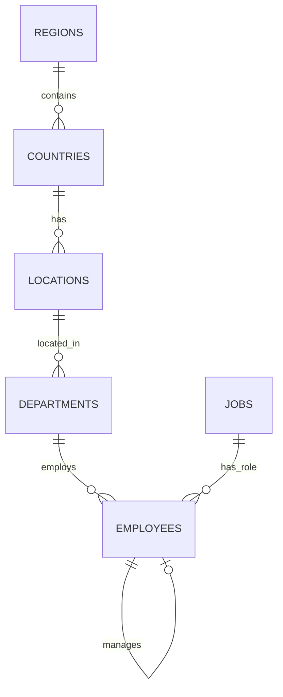

# Exercise 2.1: PostgreSQL with HR Database

> **Status:** Available

---

## General Description

You will learn to work with **PostgreSQL** using the **HR (Human Resources)** database adapted from Oracle.

**Estimated duration:** 4-6 hours
**Level:** Intermediate
**Prerequisites:** Basic SQL, having completed Exercise 1.1

---

## Learning Objectives

Upon completing this exercise you will be able to:

- Install and configure PostgreSQL on your system
- Create databases and users in PostgreSQL
- Load schemas and data from SQL scripts
- Perform complex queries with multiple JOINs
- Use PostgreSQL-specific functions
- Compare SQL syntax: Oracle vs PostgreSQL

---

## HR Database

The HR database is an official Oracle sample database that models a human resources management system.

### Main Entities

- **Employees** - Employee information
- **Departments** - Company departments
- **Jobs** - Job positions
- **Locations** - Geographic locations
- **Countries** - Countries
- **Regions** - Regions
- **Job_History** - Employee work history

### Simplified ER Diagram



---

## Technical Requirements

### Required Software

1. **PostgreSQL 14+**
   - [Download for Windows](https://www.postgresql.org/download/windows/)
   - [Download for Mac](https://www.postgresql.org/download/macosx/)
   - [Download for Linux](https://www.postgresql.org/download/linux/)

2. **SQL Client (choose one):**
   - pgAdmin (included with PostgreSQL)
   - DBeaver (recommended for beginners)
   - VS Code with PostgreSQL extension

3. **Python (optional):**
   - psycopg2 for connecting from Python
   ```bash
   pip install psycopg2-binary
   ```

---

## Exercise Content

The complete exercise is located at:

```
ejercicios/01_bases_de_datos/2.1_postgresql_hr/
```

### Structure

- `README.md` - Detailed instructions
- `scripts/` - SQL scripts (to be completed by students)
- `soluciones/` - Reference solutions

### Data

HR database scripts are located at: `datos/oracle_hr/`

---

## Topics Covered

### 1. Installation and Configuration
- Install PostgreSQL
- Create user and database
- Configure connection

### 2. Data Loading
- Execute DDL scripts (structure)
- Execute DML scripts (data)
- Verify integrity

### 3. Basic Queries
- SELECT with filters
- Sorting and limits
- Aggregate functions

### 4. Advanced Queries
- Multiple JOINs
- Subqueries
- CTEs (Common Table Expressions)
- Window Functions

### 5. Business Analysis
- Salaries by department
- Employee hierarchies
- Work history

---

## Submissions

Check the [submission instructions](../../entregas/01_bases_de_datos/) to know which files to upload.

**Submission folder:**
```
entregas/01_bases_de_datos/tu_apellido_nombre/2.1_postgresql_hr/
```

---

## Support Resources

### Official Documentation
- [PostgreSQL Documentation](https://www.postgresql.org/docs/)
- [PostgreSQL Tutorial](https://www.postgresqltutorial.com/)

### Tutorials
- [PostgreSQL Installation Guide](https://www.postgresql.org/docs/current/tutorial-install.html)
- [Advanced SQL in PostgreSQL](https://www.postgresqltutorial.com/postgresql-tutorial/postgresql-cte/)

### Comparisons
- [Oracle vs PostgreSQL - Syntax Differences](https://wiki.postgresql.org/wiki/Oracle_to_Postgres_Conversion)

---

## Next Steps

After completing this exercise:

1. **Exercise 2.2** - PostgreSQL Jardineria (more complex queries)
2. **Exercise 2.3** - Migration from SQLite to PostgreSQL
3. **Exercise 3.1** - Oracle with HR Database (compare with PostgreSQL)

---

**Publication date:** To be defined
**Last updated:** 2025-12-17
