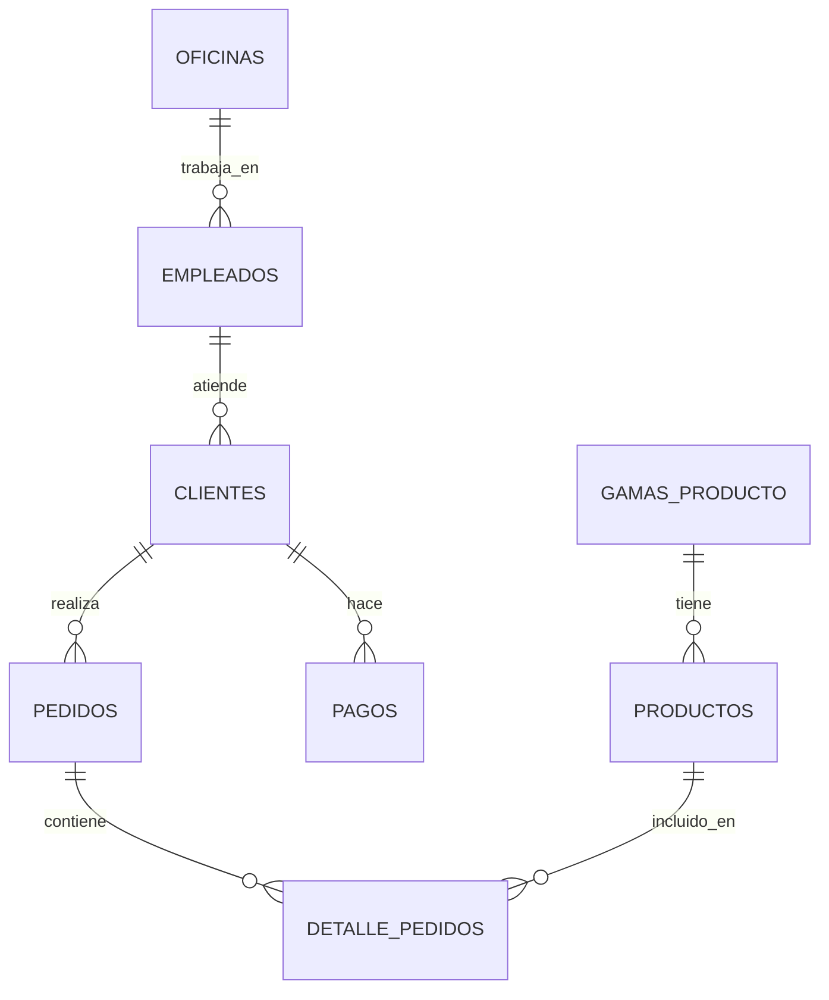

# Exercise 2.2: PostgreSQL with Jardineria Database

> **Status:** Available

---

## General Description

You will practice advanced SQL queries with a **garden sales management** database.

**Estimated duration:** 4-6 hours
**Level:** Intermediate
**Prerequisites:** Basic SQL, Exercise 2.1 (PostgreSQL HR)

---

## Learning Objectives

Upon completing this exercise you will be able to:

- Analyze sales data with SQL
- Generate business reports
- Use complex aggregations (GROUP BY, HAVING)
- Apply Window Functions for rankings and temporal analysis
- Optimize queries with indexes
- Create materialized views

---

## Jardineria Database

Database for a company that sells gardening products and plants.

### Main Entities

- **Clientes** - Company clients
- **Empleados** - Organization and sales
- **Oficinas** - Company locations
- **Pedidos** - Purchase orders
- **Detalle_Pedidos** - Line items for each order
- **Productos** - Product catalog
- **Gamas_Producto** - Categories
- **Pagos** - Transactions

### ER Diagram



---

## Real-World Use Cases

This exercise simulates analyses you would perform in a real company:

### 1. Sales Analysis
- Total sales by client
- Best-selling products
- Sales trends by month/year

### 2. Client Management
- Clients with highest purchase volume
- Inactive clients (no recent orders)
- Geographic distribution

### 3. Employee Performance
- Sales per employee
- Clients assigned per employee
- Performance by office

### 4. Inventory
- Low-stock products
- Turnover analysis
- Products with no sales

---

## Technical Requirements

- PostgreSQL 14+ installed (from Exercise 2.1)
- SQL Client (pgAdmin, DBeaver)

---

## Exercise Content

The complete exercise is located at:

```
ejercicios/01_bases_de_datos/2.2_postgresql_jardineria/
```

### Data

SQL scripts are located at: `datos/jardineria/`

---

## Topics Covered

### 1. Analytical Queries
- Aggregations with GROUP BY
- Filtering with HAVING
- Multiple JOINs

### 2. Window Functions
- ROW_NUMBER() for rankings
- LAG/LEAD for temporal comparisons
- PARTITION BY for group analysis

### 3. Subqueries
- Correlated subqueries
- EXISTS / NOT EXISTS
- IN / NOT IN

### 4. Optimization
- EXPLAIN for analyzing execution plans
- Index creation
- Performance analysis

### 5. Views
- Simple views
- Materialized views
- View updates

---

## Submissions

Check the [submission instructions](../../entregas/01_bases_de_datos/) to know which files to upload.

**Submission folder:**
```
entregas/01_bases_de_datos/tu_apellido_nombre/2.2_postgresql_jardineria/
```

---

## Support Resources

### Documentation
- [PostgreSQL Window Functions](https://www.postgresql.org/docs/current/tutorial-window.html)
- [Query Optimization](https://www.postgresql.org/docs/current/using-explain.html)

### Tutorials
- [Sales Analysis with SQL](https://www.postgresqltutorial.com/)
- [Window Functions Explained](https://www.postgresql.org/docs/current/functions-window.html)

---

## Next Steps

After completing this exercise:

1. **Exercise 2.3** - Migration SQLite to PostgreSQL
2. **Exercise 3.2** - Oracle Jardineria (compare implementation)

---

**Publication date:** To be defined
**Last updated:** 2025-12-17
