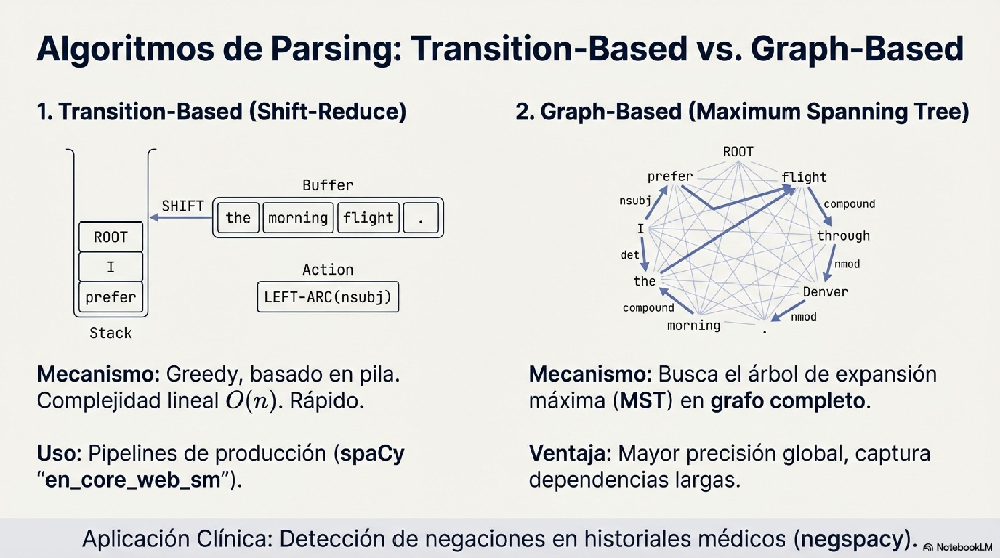

# Modulo 05: NLP y Text Mining

> **Estado:** Disponible

---

## Descripcion General

Introduccion al procesamiento de datos no estructurados mediante tecnicas de Natural Language Processing. Desde tokenizacion basica hasta analisis de sentimiento y similitud de documentos.

**Nivel:** Intermedio-Avanzado
**Tecnologias:** Python, NLTK, TF-IDF, Scikit-learn
**Prerequisitos:** Python intermedio, estadistica basica


---

## Objetivos de Aprendizaje

- Comprender la tokenizacion y normalizacion de texto
- Eliminar stopwords y aplicar filtros de ruido
- Calcular similitud entre documentos con Distancia de Jaccard
- Vectorizar texto con TF-IDF
- Aplicar clustering sobre documentos vectorizados
- Realizar analisis de sentimiento basico

---

## Material Visual del Curso

### Mas alla del Bag-of-Words


### El Desafio de la Tokenizacion Multilingue


### Dependency Parsing: La Jerarquia del Pensamiento


### Algoritmos de Parsing



---

## Conceptos Clave

| Concepto | Descripcion |
|----------|-------------|
| **Tokenizacion** | Dividir texto en unidades procesables (tokens) |
| **Stopwords** | Eliminacion de ruido (articulos, preposiciones) |
| **Similitud Jaccard** | Medicion matematica de que tan parecidos son dos documentos |
| **TF-IDF** | Vectorizacion que pondera importancia de terminos en un corpus |
| **Sentiment Analysis** | Clasificacion polar (Positivo/Negativo) basada en lexicos |
| **Clustering** | Agrupacion de documentos por similitud semantica |

---

## Contenido del Modulo

El modulo completo esta en:

```
ejercicios/05_nlp_text_mining/
├── 01_conteo_palabras.py          # Tokenizacion y conteo
├── 02_limpieza_texto.py           # Stopwords y filtrado
├── 03_sentimiento.py              # Analisis de sentimiento
├── 04_similitud_jaccard.py        # Similitud entre documentos
├── 05_vectorizacion_clustering.py # TF-IDF + K-Means
└── requirements.txt               # nltk, scikit-learn
```

---

## Ejercicios Practicos

### 01 - Conteo de Palabras
Tokenizacion basica, normalizacion y frecuencia de terminos.

### 02 - Filtro de Stopwords
Eliminacion de ruido para revelar las palabras con peso real.

### 03 - Analisis de Sentimiento
Clasificacion polar usando lexicos predefinidos.

### 04 - Similitud de Jaccard
Comparar documentos mediante la Distancia de Jaccard.

**Reto Principal:** Implementar un sistema que compare descripciones de politicas publicas de diferentes paises y detecte cuales son semanticamente similares.

### 05 - Vectorizacion y Clustering
TF-IDF para representacion numerica + K-Means para agrupacion.

---

## Dashboards

Explora los resultados visualmente:

- [Conteo de Palabras](../dashboards/EJERCICIO_01_CONTEO.md)
- [Filtro de Stopwords](../dashboards/EJERCICIO_02_LIMPIEZA.md)
- [Similitud de Jaccard](../dashboards/04_similitud_jaccard.md)
- [Vectorizacion y Clustering](../dashboards/05_vectorizacion_y_clustering.md)

---

**Curso:** Big Data con Python - De Cero a Produccion
**Profesor:** Juan Marcelo Gutierrez Miranda | @TodoEconometria
**Hash ID:** 4e8d9b1a5f6e7c3d2b1a0f9e8d7c6b5a4f3e2d1c0b9a8f7e6d5c4b3a2f1e0d9c
**Metodologia:** Ejercicios progresivos con datos reales y herramientas profesionales

**Referencias academicas:**

- Jurafsky, D., & Martin, J. H. (2024). Speech and Language Processing (3rd ed.). Prentice Hall.
- Manning, C. D., Raghavan, P., & Schutze, H. (2008). Introduction to Information Retrieval. Cambridge University Press.
- Bird, S., Klein, E., & Loper, E. (2009). Natural Language Processing with Python. O'Reilly Media.
