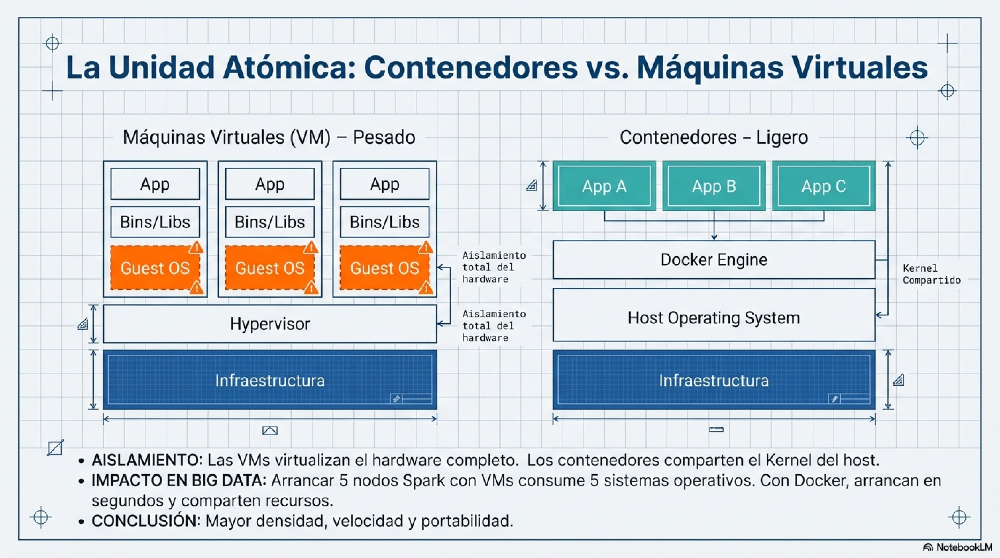

# Module 07: Big Data Infrastructure

**Level:** Intermediate-Advanced | **Type:** Theoretical-Conceptual with practical examples

---

## Objective

Understand **how the infrastructure is built** that supports processing large volumes of data. Not just use the tools, but understand why they exist, how they connect to each other, and how they are orchestrated.

This module lays the foundation for the **Capstone Project**, where each student builds their own Docker + Spark infrastructure from scratch.


---

## Module Structure

| Section | Topic | Question it answers |
|---------|------|----------------------|
| **7.1** | Docker Compose | How do I package and connect services? |
| **7.2** | Apache Spark Cluster | How do I process data in parallel? |

!!! tip "Study order"
    Study in order. Docker is the foundation on which Spark is built.

---

## 7.1 Docker Compose: Containers and Orchestration

### The Problem: Dependency Hell


### Containers vs Virtual Machines



### Images vs Containers


### Orchestration with Docker Compose


### What you will learn

- What Docker is and why it solves "dependency hell"
- Difference between **containers** and **virtual machines**
- **Images**, **containers**, and **Dockerfile** (layers, cache, Docker Hub)
- **Docker Compose**: orchestrate multiple services with a single YAML file
- Key directives: `services`, `image`, `build`, `ports`, `environment`, `volumes`, `networks`, `depends_on`, `healthcheck`, `restart`
- **Docker networking**: types (bridge, host, overlay), internal DNS, communication by service name
- **Volumes**: named volumes, bind mounts, tmpfs, data persistence
- **Essential commands**: `docker compose up/down/ps/logs/exec`
- **Common errors**: port in use, connection refused, lost data, depends_on without healthcheck
- **Orchestration principle**: Docker Compose vs Docker Swarm vs Kubernetes
- **Useful patterns**: `.env` files, `docker-compose.override.yml`, multi-stage builds, profiles

### Example: Complete Docker Compose Stack

```yaml
services:
  postgres:
    image: postgres:16
    container_name: bigdata_postgres
    environment:
      POSTGRES_USER: alumno
      POSTGRES_PASSWORD: bigdata2026
      POSTGRES_DB: curso_bigdata
    ports:
      - "5432:5432"
    volumes:
      - pgdata:/var/lib/postgresql/data
    networks:
      - red_bigdata
    healthcheck:
      test: ["CMD-SHELL", "pg_isready -U alumno"]
      interval: 10s
      timeout: 5s
      retries: 5

  pgadmin:
    image: dpage/pgadmin4
    ports:
      - "8080:80"
    depends_on:
      postgres:
        condition: service_healthy
    networks:
      - red_bigdata

volumes:
  pgdata:

networks:
  red_bigdata:
    driver: bridge
```

### Key Docker Concepts

| Concept | Description |
|---------|-------------|
| **Image** | Immutable template with everything needed to run an app |
| **Container** | Running instance of an image |
| **Dockerfile** | Recipe to build an image (cacheable layers) |
| **Volume** | Data persistence beyond the container lifecycle |
| **Network** | Internal network for communication between containers (automatic DNS) |
| **Healthcheck** | Verification that a service is ready to accept connections |

---

## 7.2 Apache Spark Cluster: Architecture and Distributed Computing

### What you will learn

- Spark history: from MapReduce to in-memory processing (100x faster)
- **Master-Worker Architecture**: Driver, SparkSession, Cluster Manager, Workers, Executors, Tasks
- **Spark Standalone Mode**: master, workers, resource allocation, Web UI
- **Building a cluster with Docker**: containers as nodes, shared volumes, `apache/spark` image (official)
- **SparkSession**: entry point, local vs cluster modes, key configurations
- **Lazy Evaluation and DAG**: transformations vs actions, Catalyst optimizer, predicate pushdown
- **Deployment modes**: Local, Standalone, YARN, Kubernetes
- **Basic tuning**: sizing executors, partitions, small file problem, data locality
- **Monitoring with Spark UI**: Jobs, Stages, Storage, Executors, REST API
- **Spark + PostgreSQL**: JDBC connector, reading and writing data between Spark and PostgreSQL
- **From Standalone to production**: Kubernetes, managed services (EMR, Dataproc, Databricks)

### Example: Spark Cluster with Docker Compose

```yaml
services:
  spark-master:
    image: apache/spark:3.5.4-python3
    container_name: spark-master
    command: /opt/spark/bin/spark-class org.apache.spark.deploy.master.Master
    environment:
      - SPARK_NO_DAEMONIZE=true
    ports:
      - "7077:7077"    # Cluster communication
      - "8080:8080"    # Master Web UI

  spark-worker-1:
    image: apache/spark:3.5.4-python3
    command: >
      /opt/spark/bin/spark-class org.apache.spark.deploy.worker.Worker
      spark://spark-master:7077
    environment:
      - SPARK_WORKER_MEMORY=4G
      - SPARK_WORKER_CORES=2
      - SPARK_NO_DAEMONIZE=true
    depends_on:
      - spark-master
```

!!! warning "Official image"
    We use `apache/spark` (the official Apache image). The `bitnami/spark` image was **discontinued in September 2025** and no longer receives updates.

### Spark Architecture

```
Driver Program (tu script Python)
    │
    ▼
SparkSession → SparkContext
    │
    ▼
Cluster Manager (Standalone / YARN / K8s)
    │
    ├── Worker 1 → Executor → Tasks (procesan particiones)
    ├── Worker 2 → Executor → Tasks
    └── Worker N → Executor → Tasks
```

### Transformations vs Actions

| Transformations (LAZY) | Actions (trigger execution) |
|--------------------------|-------------------------------|
| `select()`, `filter()`, `groupBy()` | `show()`, `count()`, `collect()` |
| `join()`, `orderBy()`, `withColumn()` | `write`, `toPandas()`, `take(n)` |
| Do not execute anything immediately | Trigger the entire chain of transformations |

---

## Relationship with Other Modules

| Module | Connection |
|--------|----------|
| Module 2 (ETL) | ETL pipelines on Docker infrastructure |
| Module 3 (Distributed Processing) | Practical exercises with PySpark and Dask |
| Module 4 (Panel Data) | Complete Spark pipeline on QoG dataset |
| Module 6 (Streaming) | Kafka and Spark Streaming on Docker |
| Capstone Project | The student builds Docker + Spark infrastructure from scratch |

---

## Requirements

- Docker Desktop installed
- Having completed at least Module 1 (Databases)
- Basic terminal/PowerShell knowledge

---

## Module Materials

The complete content for each section is in the README files of the module folder:

- [7.1 Docker Compose](https://github.com/TodoEconometria/ejercicios-bigdata/tree/main/ejercicios/07_infraestructura_bigdata/7.1_docker_compose) - Containers, images, orchestration, networks, volumes
- [7.2 Cluster Spark](https://github.com/TodoEconometria/ejercicios-bigdata/tree/main/ejercicios/07_infraestructura_bigdata/7.2_cluster_spark) - Distributed architecture, Docker cluster, tuning, JDBC

---

## Glossary

| Term | Definition |
|------|-----------|
| **Container** | Isolated instance that shares the host kernel (lightweight, fast) |
| **Image** | Immutable template for creating containers (cacheable layers) |
| **Docker Compose** | Tool for orchestrating multiple containers with a YAML file |
| **Driver** | Main Spark process that coordinates the cluster |
| **Executor** | JVM process on a Worker that runs tasks |
| **Task** | Minimum unit of work; processes one partition |
| **DAG** | Directed Acyclic Graph of the execution plan |
| **Lazy Evaluation** | Transformations are not executed until an action triggers them |
| **Catalyst** | Spark SQL query optimizer |
| **Shuffle** | Data redistribution between nodes (network-intensive) |

---

**Course:** Big Data with Python - From Zero to Production
**Instructor:** Juan Marcelo Gutierrez Miranda | @TodoEconometria
**Hash ID:** 4e8d9b1a5f6e7c3d2b1a0f9e8d7c6b5a4f3e2d1c0b9a8f7e6d5c4b3a2f1e0d9c
**Methodology:** Progressive exercises with real data and professional tools

**Academic references:**
- Kleppmann, M. (2017). *Designing Data-Intensive Applications*. O'Reilly Media.
- Zaharia, M., et al. (2016). Apache Spark: A unified engine for big data processing. *Communications of the ACM*, 59(11), 56-65.
- Merkel, D. (2014). Docker: Lightweight Linux Containers for Consistent Development and Deployment. *Linux Journal*, 2014(239), 2.
- Chambers, B., & Zaharia, M. (2018). *Spark: The Definitive Guide*. O'Reilly Media.
- Dean, J. & Ghemawat, S. (2008). MapReduce: Simplified data processing on large clusters. *Communications of the ACM*, 51(1), 107-113.
