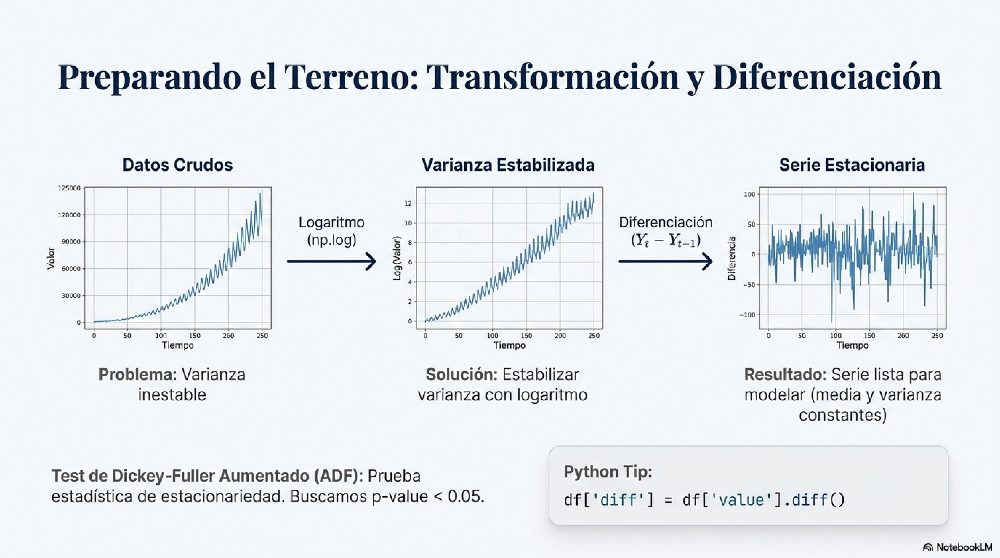
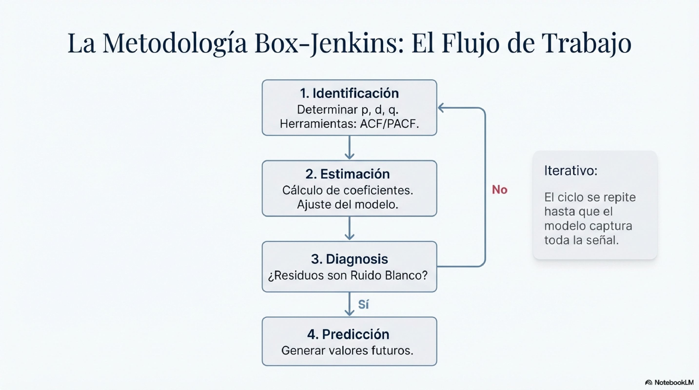

# Time Series: ARIMA/SARIMA with Box-Jenkins Methodology

> **Status:** Available

---

## General Description

We will learn to model time series using the complete **Box-Jenkins Methodology**:
identification, estimation, diagnostics, and forecasting. We will work with ARIMA and SARIMA models
to capture both trends and seasonality.

**Level:** Advanced
**Dataset:** AirPassengers (144 monthly observations, 1949-1960)
**Technologies:** Python, statsmodels, matplotlib

---

## Learning Objectives

- Understand the Box-Jenkins Methodology (4 phases)
- Identify components of a series: trend, seasonality, noise
- Use ACF and PACF to determine orders p, d, q
- Estimate ARIMA and SARIMA models
- Diagnose residuals (Ljung-Box, normality)
- Generate forecasts with confidence intervals

---

## Exercise Content

The complete exercise is located at:

```
ejercicios/04_machine_learning/07_series_temporales_arima/
├── README.md                    # Complete Box-Jenkins theory (829 lines)
├── serie_temporal_completa.py   # 10-part script (1,286 lines)
├── output/                      # Directory for generated plots
└── .gitignore                   # Excludes output/*.png and *.csv
```

### The script `serie_temporal_completa.py` covers:

1. **Loading and visualization** of the original series
2. **Decomposition** (trend + seasonality + residual)
3. **Stationarity tests** (ADF, KPSS)
4. **Differencing** (regular and seasonal)
5. **ACF/PACF** for order identification
6. **ARIMA estimation** with AIC-based selection
7. **SARIMA estimation** with seasonal component
8. **Residual diagnostics** (Ljung-Box, QQ-plot, residual ACF)
9. **Forecasting** with confidence intervals
10. **Model comparison** and metrics (MAPE, RMSE)

---

## Theory: Box-Jenkins Methodology

### Anatomy of the Signal: The Data Generating Process


### Stationarity and White Noise


### Series Decomposition


### Transformation and Differencing



### The Classic Decoder: ARIMA


### Deseasonalization and SARIMA


### The Box-Jenkins Workflow



### Phase 1: Identification

- Visualize the series and detect trend/seasonality
- Apply differencing to achieve stationarity
- Analyze ACF and PACF to determine orders (p, d, q)

### Phase 2: Estimation

- Fit ARIMA(p,d,q) or SARIMA(p,d,q)(P,D,Q)[s] model
- Compare candidate models using AIC/BIC

### Phase 3: Diagnostics

- Verify that residuals are white noise
- Ljung-Box test (autocorrelation)
- Normality test
- QQ plot

### Phase 4: Forecasting

- Generate predictions with confidence intervals
- Evaluate accuracy with metrics (MAPE, RMSE)

---

## Exercise Results

**Selected model:** SARIMA(1,1,0)(0,1,0)[12]

- AIC: -445.41
- MAPE: 7.41%
- Correctly captures trend and monthly seasonality

---

## Interactive Dashboard

You can explore the results in the interactive dashboard:

[View ARIMA/SARIMA Dashboard](../dashboards/04_series_temporales_arima.md){ .md-button .md-button--primary }

The dashboard includes 6 tabs with interactive Plotly charts:
original series, decomposition, stationarity, ACF/PACF, diagnostics, and forecasting.

---

## Resources

- [statsmodels ARIMA Documentation](https://www.statsmodels.org/stable/generated/statsmodels.tsa.arima.model.ARIMA.html)
- [statsmodels SARIMAX](https://www.statsmodels.org/stable/generated/statsmodels.tsa.statespace.sarimax.SARIMAX.html)

---

**Course:** Big Data with Python - From Zero to Production
**Instructor:** Juan Marcelo Gutierrez Miranda | @TodoEconometria
**Hash ID:** 4e8d9b1a5f6e7c3d2b1a0f9e8d7c6b5a4f3e2d1c0b9a8f7e6d5c4b3a2f1e0d9c
**Methodology:** Progressive exercises with real data and professional tools

**Academic references:**

- Box, G. E. P., Jenkins, G. M., Reinsel, G. C., & Ljung, G. M. (2015). Time Series Analysis: Forecasting and Control (5th ed.). Wiley.
- Hyndman, R. J., & Athanasopoulos, G. (2021). Forecasting: Principles and Practice (3rd ed.). OTexts.
- Hamilton, J. D. (1994). Time Series Analysis. Princeton University Press.
