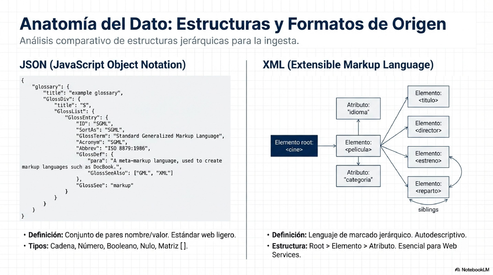

# Module 08: Data Streaming with Apache Kafka

## Introduction

**Data streaming** is the continuous processing of data in real time, as opposed to batch processing where data is accumulated and processed periodically. In modern applications such as fraud detection, IoT sensor monitoring, or seismic alerts, response time is critical.

**Apache Kafka** is a distributed streaming platform that allows you to publish, store, and process data streams in real time. Originally developed by LinkedIn and donated to Apache, Kafka has become the de facto standard for streaming data architectures.

### Data Formats for Ingestion



---

## Kafka Architecture

```
┌─────────────┐     ┌─────────────────────────────────────┐     ┌─────────────┐
│  PRODUCTOR  │────>│            KAFKA CLUSTER            │────>│ CONSUMIDOR  │
│  (Python)   │     │  ┌─────────────────────────────┐    │     │  (Python)   │
└─────────────┘     │  │  Topic: sismos              │    │     └─────────────┘
                    │  │  ├── Partition 0            │    │
┌─────────────┐     │  │  ├── Partition 1            │    │     ┌─────────────┐
│  PRODUCTOR  │────>│  │  └── Partition 2            │    │────>│ CONSUMIDOR  │
│   (API)     │     │  └─────────────────────────────┘    │     │  (Spark)    │
└─────────────┘     └─────────────────────────────────────┘     └─────────────┘
                              │
                              ▼
                    ┌─────────────────┐
                    │   KRaft Mode    │
                    │  (sin ZooKeeper)│
                    └─────────────────┘
```

### Key Concepts

| Concept | Description |
|---------|-------------|
| **Broker** | Kafka server that stores and serves messages |
| **Topic** | Logical channel where messages are published (like a table) |
| **Partition** | Division of a topic for parallelism and scalability |
| **Producer** | Application that sends messages to a topic |
| **Consumer** | Application that reads messages from a topic |
| **Consumer Group** | Set of consumers that share the load of a topic |
| **Offset** | Position of a message within a partition |

### KRaft Mode vs ZooKeeper

Since Kafka 3.x, **KRaft** (Kafka Raft) mode replaces ZooKeeper for metadata management, simplifying the architecture:

```
# Antes (con ZooKeeper) - 2 servicios
kafka + zookeeper

# Ahora (KRaft mode) - 1 servicio autocontenido
kafka
```

### Delivery Guarantees

Kafka offers three delivery semantics:

| Semantics | Description | Typical use |
|-----------|-------------|-------------|
| **At-most-once** | Message may be lost, never duplicated | Non-critical logs |
| **At-least-once** | Message may be duplicated, never lost | Processing with idempotency |
| **Exactly-once** | Message is delivered exactly once | Financial transactions |

---

## Required Tools

- **Docker** and **Docker Compose**: To set up the infrastructure
- **Python 3.9+**: Main language
- **confluent-kafka**: Official Python client for Kafka
- **requests**: To consume external APIs

### Dependency Installation

```bash
pip install confluent-kafka requests
```

---

## Challenge 1: Set Up Kafka with Docker Compose

**Objective:** Create a functional Kafka cluster on your local machine using Docker.

**Difficulty:** Basic

### Instructions

1. Create a directory for the project:
   ```bash
   mkdir kafka-streaming
   cd kafka-streaming
   ```

2. Create a `docker-compose.yml` file with a Kafka broker in KRaft mode

3. The broker must meet the following requirements:
   - Image: `apache/kafka:latest`
   - Port 9092 exposed
   - KRaft mode enabled (no ZooKeeper)
   - Environment variables correctly configured

4. Start and verify:
   ```bash
   docker-compose up -d
   docker-compose logs -f kafka
   ```

### Success Criteria

- [ ] The Kafka container is running without errors
- [ ] Logs show "Kafka Server started"
- [ ] Port 9092 responds

### Hints

- Check the documentation for the `apache/kafka` image on Docker Hub
- Key variables: `KAFKA_NODE_ID`, `KAFKA_PROCESS_ROLES`, `KAFKA_LISTENERS`
- KRaft mode requires `KAFKA_CONTROLLER_QUORUM_VOTERS`

### Resources

- [Apache Kafka Docker Image](https://hub.docker.com/r/apache/kafka)
- [KRaft Mode Documentation](https://kafka.apache.org/documentation/#kraft)

---

## Challenge 2: Your First Producer

**Objective:** Create a Python script that sends messages to Kafka.

**Difficulty:** Basic

### Instructions

1. Create `productor_simple.py`

2. The script must:
   - Connect to `localhost:9092`
   - Send 10 messages to the topic `mensajes-test`
   - Each message must be JSON with: `id`, `texto`, `timestamp`
   - Confirm each successful send

3. Base structure:
   ```python
   from confluent_kafka import Producer
   import json
   from datetime import datetime

   def delivery_callback(err, msg):
       """Callback para confirmar envio"""
       # Implementa: imprime error o confirmacion
       pass

   config = {
       'bootstrap.servers': 'localhost:9092',
       'client.id': 'productor-simple'
   }

   producer = Producer(config)

   # Implementa: enviar 10 mensajes
   # Usa: producer.produce(topic, key, value, callback=delivery_callback)
   # No olvides: producer.flush()
   ```

### Success Criteria

- [ ] Script runs without errors
- [ ] 10 messages sent successfully
- [ ] Each message has a valid JSON structure

### Hints

- `json.dumps()` to serialize to string
- The `key` can be the message ID
- `flush()` ensures all messages are sent before exiting

---

## Challenge 3: Your First Consumer

**Objective:** Create a script that reads messages from Kafka in real time.

**Difficulty:** Basic

### Instructions

1. Create `consumidor_simple.py`

2. The script must:
   - Subscribe to the topic `mensajes-test`
   - Read messages in an infinite loop
   - Print each message with its offset and partition
   - Exit cleanly with Ctrl+C

3. Base structure:
   ```python
   from confluent_kafka import Consumer, KafkaError
   import json

   config = {
       'bootstrap.servers': 'localhost:9092',
       'group.id': 'mi-grupo-consumidor',
       'auto.offset.reset': 'earliest'  # Leer desde el inicio
   }

   consumer = Consumer(config)
   consumer.subscribe(['mensajes-test'])

   try:
       while True:
           msg = consumer.poll(timeout=1.0)
           # Implementa: verificar errores y procesar mensaje
   except KeyboardInterrupt:
       pass
   finally:
       consumer.close()
   ```

### Success Criteria

- [ ] Consumer connects successfully
- [ ] Reads the producer's messages
- [ ] Displays: partition, offset, key, value
- [ ] Exits cleanly with Ctrl+C

### Hints

- Check `msg is None` (timeout with no message)
- Check `msg.error()` before processing
- Use `msg.partition()`, `msg.offset()`, `msg.key()`, `msg.value()`

---

## Challenge 4: Connect to a Real API (USGS Earthquakes)

**Objective:** Create a producer that consumes earthquake data in real time.

**Difficulty:** Intermediate

### Instructions

1. Create `productor_sismos.py`

2. The producer must:
   - Query the USGS API every 30 seconds
   - Parse the GeoJSON response
   - Publish each new earthquake to the topic `sismos`
   - Avoid duplicates (maintain a set of processed IDs)

3. API to use:
   ```
   https://earthquake.usgs.gov/earthquakes/feed/v1.0/summary/all_hour.geojson
   ```

4. Message structure to publish:
   ```json
   {
     "id": "us7000abcd",
     "magnitud": 4.5,
     "lugar": "10km SSW of Somewhere",
     "latitud": -33.45,
     "longitud": -70.66,
     "profundidad_km": 10.0,
     "timestamp": "2024-01-15T10:30:00.000Z",
     "tsunami": false
   }
   ```

### Success Criteria

- [ ] Queries the API every 30 seconds
- [ ] Publishes earthquakes to the topic `sismos`
- [ ] Does not publish duplicate earthquakes
- [ ] Handles network errors gracefully
- [ ] Runs continuously

### Hints

- Earthquakes are in `response['features']`
- The ID is in `feature['id']`
- Properties are in `feature['properties']`
- Coordinates are in `feature['geometry']['coordinates']` (lon, lat, depth)

---

## Challenge 5: Alert System

**Objective:** Create a consumer that detects significant earthquakes.

**Difficulty:** Intermediate

### Instructions

1. Create `consumidor_alertas.py`

2. The consumer must:
   - Read from the topic `sismos`
   - Filter earthquakes with magnitude >= 4.5
   - Display a highlighted alert in the console
   - Save alerts to `alertas.log`

3. Alert format:
   ```
   ╔════════════════════════════════════════╗
   ║         ALERTA SISMICA                 ║
   ╠════════════════════════════════════════╣
   ║ Magnitud: 5.2                          ║
   ║ Lugar: 10km S of Tokyo, Japan          ║
   ║ Hora: 2024-01-15 10:30:00              ║
   ║ Coords: (35.6, 139.7)                  ║
   ║ Profundidad: 10.5 km                   ║
   ╚════════════════════════════════════════╝
   ```

### Success Criteria

- [ ] Correctly filters by magnitude >= 4.5
- [ ] Alerts visible in the console
- [ ] Alerts saved to log file
- [ ] System runs continuously

---

## Challenge 6: Aggregations with Spark Structured Streaming

**Objective:** Process the earthquake stream with Spark to calculate statistics.

**Difficulty:** Advanced

### Instructions

1. Add a Spark service to your `docker-compose.yml`

2. Create `spark_streaming_sismos.py`

3. The job must:
   - Read from the topic `sismos` as a stream
   - Parse the JSON messages
   - Calculate per 5-minute window:
     - Earthquake count
     - Average magnitude
     - Maximum magnitude
   - Write results to the console

4. Base structure:
   ```python
   from pyspark.sql import SparkSession
   from pyspark.sql.functions import *
   from pyspark.sql.types import *

   spark = SparkSession.builder \
       .appName("SismosStreaming") \
       .config("spark.jars.packages", "org.apache.spark:spark-sql-kafka-0-10_2.12:3.5.0") \
       .getOrCreate()

   # Define schema del mensaje
   schema = StructType([
       StructField("id", StringType()),
       StructField("magnitud", DoubleType()),
       # ... completa el schema
   ])

   # Lee del topic
   df = spark.readStream \
       .format("kafka") \
       .option("kafka.bootstrap.servers", "kafka:9092") \
       .option("subscribe", "sismos") \
       .load()

   # Parsea el JSON
   sismos = df.select(
       from_json(col("value").cast("string"), schema).alias("data")
   ).select("data.*")

   # Implementa: agregaciones por ventana de tiempo
   # Usa: window(), avg(), max(), count()
   ```

### Success Criteria

- [ ] Spark reads from the Kafka topic
- [ ] Correctly parses the messages
- [ ] Calculates aggregations per window
- [ ] Displays results in the console

---

## FINAL Challenge: Visualization Dashboard

**Objective:** Create a web visualization that displays earthquakes in real time.

**Difficulty:** Advanced

### Evaluation Criteria

| Criterion | Points |
|-----------|--------|
| Interactive map with earthquake locations | 20 |
| Automatic updates without reloading | 20 |
| Live statistics (total, max, average) | 15 |
| Magnitude filters | 15 |
| Visual differentiation by magnitude | 15 |
| Professional design | 15 |
| **Total** | **100** |

### Technical Requirements

- HTML5 + vanilla JavaScript (no frameworks)
- Leaflet.js for maps
- Fetch API to retrieve data
- Modern CSS (flexbox/grid)

### Suggestions

- Query the USGS API directly from JavaScript
- Use `setInterval()` for automatic updates
- Implement colors by magnitude (risk scale)

### Submission

- Self-contained HTML file
- Screenshot showing it working
- Brief usage documentation

> **Reference:** You can see an example dashboard at
> [Seismic Observatory](../dashboards/dashboard_sismos_global.md),
> but the challenge is to create your own version with your own style.

---

## Resources and References

### Official Documentation

- [Apache Kafka Documentation](https://kafka.apache.org/documentation/)
- [Confluent Python Client](https://docs.confluent.io/kafka-clients/python/current/overview.html)
- [Spark Structured Streaming + Kafka](https://spark.apache.org/docs/latest/structured-streaming-kafka-integration.html)
- [USGS Earthquake API](https://earthquake.usgs.gov/fdsnws/event/1/)

### Earthquake GeoJSON

- Last hour: `https://earthquake.usgs.gov/earthquakes/feed/v1.0/summary/all_hour.geojson`
- Last day: `https://earthquake.usgs.gov/earthquakes/feed/v1.0/summary/all_day.geojson`
- Last week: `https://earthquake.usgs.gov/earthquakes/feed/v1.0/summary/all_week.geojson`

---

**Course:** Big Data with Python - From Zero to Production
**Instructor:** Juan Marcelo Gutierrez Miranda | @TodoEconometria
**Hash ID:** 4e8d9b1a5f6e7c3d2b1a0f9e8d7c6b5a4f3e2d1c0b9a8f7e6d5c4b3a2f1e0d9c
**Methodology:** Progressive exercises with real data and professional tools

**Academic References:**

- Kreps, J., Narkhede, N., & Rao, J. (2011). Kafka: A distributed messaging system for log processing. *Proceedings of the NetDB Workshop*.
- Zaharia, M., et al. (2016). Apache Spark: A unified engine for big data processing. *Communications of the ACM, 59*(11), 56-65.
- Kleppmann, M. (2017). *Designing Data-Intensive Applications*. O'Reilly Media. ISBN: 978-1449373320.
- Narkhede, N., Shapira, G., & Palino, T. (2017). *Kafka: The Definitive Guide*. O'Reilly Media. ISBN: 978-1491936160.
- USGS (2024). Earthquake Hazards Program - Real-time Feeds. United States Geological Survey.
