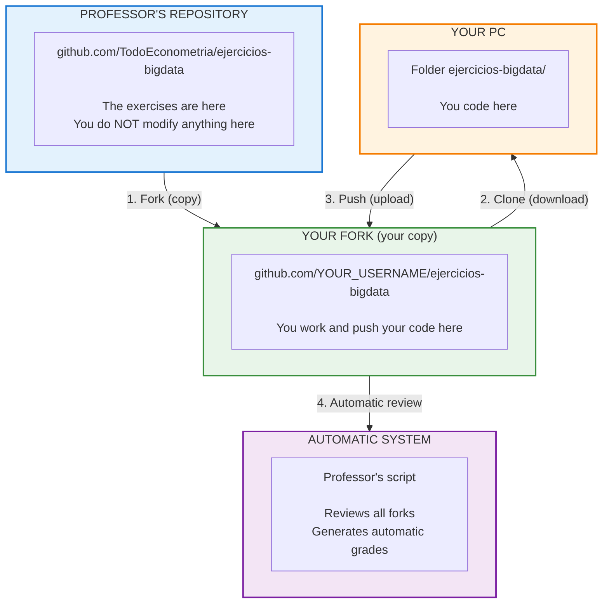

# How to Submit Your Work

This guide explains **step by step** how to submit. You don't need to know advanced Git.

---

## Summary in 30 Seconds

```
1. You fork the repo (only once)
2. You work in YOUR fork
3. You push your changes to YOUR fork
4. The professor reviews YOUR fork automatically (no PR)
```

**You do NOT need to create a Pull Request.** The automatic system evaluates
your **PROMPTS.md** file directly in your fork.

---

## Workflow Diagram



---

## Step 1: Create Your Fork (only once)

A "fork" is your personal copy of the repository.

1. Go to: [github.com/TodoEconometria/ejercicios-bigdata](https://github.com/TodoEconometria/ejercicios-bigdata)
2. Click the **"Fork"** button (top right)
3. Click **"Create fork"**
4. Done! Now you have `github.com/YOUR_USERNAME/ejercicios-bigdata`

!!! success "You only do this ONCE"
    Your fork is yours forever. All your work goes there.

---

## Step 2: Download to Your PC (only once)

```bash
# In your terminal (CMD, PowerShell, or Terminal)
cd Documentos
git clone https://github.com/YOUR_USERNAME/ejercicios-bigdata.git
cd ejercicios-bigdata
```

Replace `YOUR_USERNAME` with your GitHub username.

!!! info "Now you have the folder"
    Look in `Documents/ejercicios-bigdata/`. You will always work there.

---

## Step 3: Create Your Submission Folder

Inside your repository folder, create your personal folder:

```
For the Final Project:
entregas/trabajo_final/lastname_firstname/

For database exercises:
entregas/01_bases_de_datos/1.1_sqlite/lastname_firstname/
```

!!! warning "Name format"
    - All in **lowercase**
    - No accents or spaces
    - Format: `lastname_firstname`
    - Example: `garcia_maria`, `lopez_juan`

### For the Final Project, copy the template:

```bash
# From the repository folder:
cp -r trabajo_final/plantilla/ entregas/trabajo_final/your_lastname_firstname/
```

This creates all the files you need to complete.

---

## Step 4: Work and Document Your Prompts

### The most important file: PROMPTS.md

Inside your folder you will find `PROMPTS.md`. This file is **WHAT GETS EVALUATED**.

```
entregas/trabajo_final/garcia_maria/
├── PROMPTS.md          ← MANDATORY - Your AI prompts
├── docker-compose.yml  ← Your infrastructure
├── pipeline.py         ← Your code
└── ... other files
```

### What goes in PROMPTS.md

| Section | What to include |
|---------|-----------------|
| **Prompt A, B, C** | Your REAL prompts copied exactly as-is (with errors and all) |
| **Blueprint** | At the end, ask the AI for a professional summary |

!!! danger "VERY IMPORTANT"
    **DO NOT correct your prompts.** If you wrote "how do i maek sparck read the csv"
    with errors, paste THAT. The system detects if you "cleaned" your prompts.

    Perfect prompts in Part 1 = SUSPICIOUS.

---

## Step 5: Upload Your Work

When you finish (or want to save progress):

```bash
# From the repository folder
git add .
git commit -m "Final Project Submission - Garcia Maria"
git push
```

!!! tip "What each command does"
    - `git add .` → Stages all your files
    - `git commit -m "..."` → Saves with a message
    - `git push` → Uploads to your fork on GitHub

---

## Step 6: Verify Your Submission

1. Go to your fork: `github.com/YOUR_USERNAME/ejercicios-bigdata`
2. Navigate to `entregas/trabajo_final/your_lastname_firstname/`
3. Verify that all your files are there

!!! success "Done!"
    You don't need to do anything else. The automatic system reviews your
    **PROMPTS.md** file and generates grades based on your learning process.

---

## Keep Your Fork Up to Date

The professor adds new exercises. Your fork does NOT update on its own.

### Easy Method (from GitHub)

1. Go to your fork on GitHub
2. If you see a yellow banner "This branch is X commits behind", click it
3. Click **"Sync fork"** → **"Update branch"**
4. On your PC: `git pull`

### Terminal Method

```bash
# Add the professor's repo as "upstream" (only once)
git remote add upstream https://github.com/TodoEconometria/ejercicios-bigdata.git

# Update
git fetch upstream
git merge upstream/main
git push
```

!!! tip "When to sync"
    Do it **every Monday** before class to get the new exercises.

---

## Submission Structure - Final Project

```
entregas/trabajo_final/lastname_firstname/
│
├── PROMPTS.md              ← THE MOST IMPORTANT (this is evaluated)
│
├── 01_README.md            ← Your research question
├── 02_INFRAESTRUCTURA.md   ← Explanation of your Docker setup
├── 03_RESULTADOS.md        ← Graphs and interpretation
├── 04_REFLEXION_IA.md      ← 3 key moments
├── 05_RESPUESTAS.md        ← Comprehension questions
│
├── docker-compose.yml      ← Your working YAML
├── pipeline.py             ← Your ETL + analysis code
├── requirements.txt        ← Dependencies
│
└── .gitignore              ← Exclude large data files
```

---

## What NOT to Upload

The `.gitignore` already protects this, but remember:

- No data files (`.csv`, `.parquet`, `.db`)
- No `venv/` or `.venv/` folder
- No `__pycache__/` folder
- No `.env` files with credentials
- No files larger than 10MB

---

## How It Is Evaluated (PROMPTS-Based System)

!!! danger "THE MOST IMPORTANT: PROMPTS.md"
    **The PROMPTS.md file is what gets evaluated.** Not the code, not the YAML,
    but YOUR documented AI PROMPTS.

The automatic system reviews:

```
1. Reads the student list (registered forks)
2. For each fork:
   - Verifies that PROMPTS.md exists (MANDATORY)
   - Analyzes quality and authenticity of prompts
   - Detects if prompts were "cleaned" by AI
   - Reviews coherence between prompts and submitted code
   - Calculates automatic grade based on learning process
3. Generates report with:
   - Ranking of all students
   - Outstanding (possible bonus)
   - Suspicious (require verification)
```

### Automatic Alerts

| Alert | Meaning |
|-------|---------|
| OUTSTANDING | Exceptional work, review for bonus |
| NORMAL | Meets requirements, automatic grade |
| REVIEW | Something doesn't add up, professor will verify |
| REJECTED | Copy detected or requirements not met |

---

## Common Problems

### "I don't have the template"

```bash
# Update your fork first
git fetch upstream
git merge upstream/main

# Now copy the template
cp -r trabajo_final/plantilla/ entregas/trabajo_final/your_lastname/
```

### "Git is asking for username and password"

Use your GitHub account. If it fails, configure:

```bash
git config --global user.email "tu@email.com"
git config --global user.name "Tu Nombre"
```

### "My changes don't appear on GitHub"

Verify you did all 3 steps:

```bash
git add .                    # 1. Stage
git commit -m "message"      # 2. Save
git push                     # 3. Upload  ← This one actually uploads
```

### "I want to start over"

```bash
# Delete your folder and copy the template again
rm -rf entregas/trabajo_final/your_lastname/
cp -r trabajo_final/plantilla/ entregas/trabajo_final/your_lastname/
```

---

## Dates and Deadlines

| Submission | Deadline |
|------------|----------|
| Final Project | [See course calendar] |

!!! warning "Late submissions"
    The system reviews on the indicated date. Whatever is not in your fork
    by that date will not be evaluated.

---

## Visual Summary

```
┌─────────────────────────────────────────────────────────────────┐
│                    YOUR WORKFLOW                                  │
├─────────────────────────────────────────────────────────────────┤
│                                                                 │
│  1. Fork (once)                                                 │
│     └── Create your copy on GitHub                              │
│                                                                 │
│  2. Clone (once)                                                │
│     └── Download to your PC                                     │
│                                                                 │
│  3. Copy template                                               │
│     └── cp -r trabajo_final/plantilla/ entregas/.../your_name/  │
│                                                                 │
│  4. Work with AI                                                │
│     └── Save prompts in PROMPTS.md (with errors and all)        │
│                                                                 │
│  5. Upload changes                                              │
│     └── git add . && git commit -m "..." && git push            │
│                                                                 │
│  6. Verify on GitHub                                            │
│     └── Confirm your files are there                            │
│                                                                 │
│  7. Automatic evaluation                                        │
│     └── The professor reviews all forks without you doing       │
│         anything                                                │
│                                                                 │
└─────────────────────────────────────────────────────────────────┘
```

---

## Help

If you have problems:

1. Review this guide again
2. Ask a classmate
3. Ask the professor in class
4. Check the [sync guide](../git-github/sincronizar-fork.md)

---

**Last updated:** 2026-02-04
