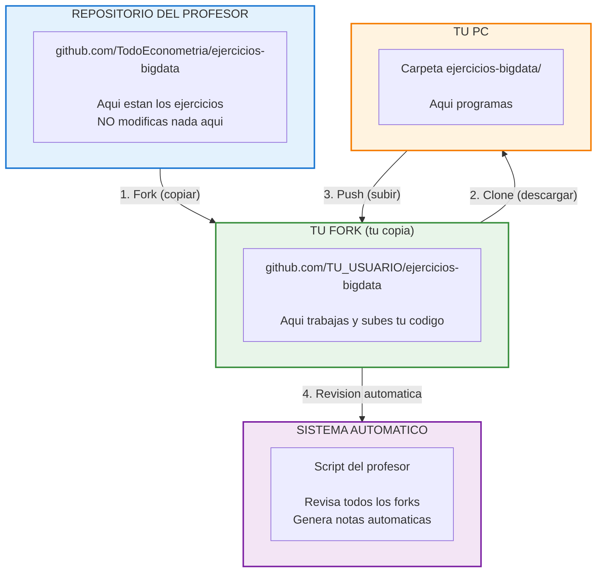

# Como Entregar tus Trabajos

Esta guia te explica **paso a paso** como entregar. No necesitas saber Git avanzado.

---

## Resumen en 30 segundos

```
1. Haces fork del repo (solo una vez)
2. Trabajas en TU fork
3. Subes tus cambios a TU fork
4. El profesor revisa TU fork automaticamente (sin PR)
```

**NO necesitas crear Pull Request.** El sistema automatico evalua
tu archivo **PROMPTS.md** directamente en tu fork.

---

## Diagrama del Flujo



---

## Paso 1: Crear tu Fork (solo una vez)

Un "fork" es tu copia personal del repositorio.

1. Ve a: [github.com/TodoEconometria/ejercicios-bigdata](https://github.com/TodoEconometria/ejercicios-bigdata)
2. Click en el boton **"Fork"** (arriba a la derecha)
3. Click en **"Create fork"**
4. Listo! Ahora tienes `github.com/TU_USUARIO/ejercicios-bigdata`

!!! success "Solo haces esto UNA VEZ"
    Tu fork es tuyo para siempre. Todos tus trabajos van ahi.

---

## Paso 2: Descargar a tu PC (solo una vez)

```bash
# En tu terminal (CMD, PowerShell, o Terminal)
cd Documentos
git clone https://github.com/TU_USUARIO/ejercicios-bigdata.git
cd ejercicios-bigdata
```

Cambia `TU_USUARIO` por tu nombre de usuario de GitHub.

!!! info "Ahora tienes la carpeta"
    Busca en `Documentos/ejercicios-bigdata/`. Ahi trabajaras siempre.

---

## Paso 3: Crear tu carpeta de entrega

Dentro de tu carpeta del repositorio, crea tu carpeta personal:

```
Para Trabajo Final:
entregas/trabajo_final/apellido_nombre/

Para ejercicios de BD:
entregas/01_bases_de_datos/1.1_sqlite/apellido_nombre/
```

!!! warning "Formato del nombre"
    - Todo en **minusculas**
    - Sin tildes ni espacios
    - Formato: `apellido_nombre`
    - Ejemplo: `garcia_maria`, `lopez_juan`

### Para el Trabajo Final, copia la plantilla:

```bash
# Desde la carpeta del repositorio:
cp -r trabajo_final/plantilla/ entregas/trabajo_final/tu_apellido_nombre/
```

Esto te crea todos los archivos que necesitas completar.

---

## Paso 4: Trabajar y documentar tus prompts

### El archivo mas importante: PROMPTS.md

Dentro de tu carpeta encontraras `PROMPTS.md`. Este archivo es **LO QUE SE EVALUA**.

```
entregas/trabajo_final/garcia_maria/
├── PROMPTS.md          ← OBLIGATORIO - Tus prompts de IA
├── docker-compose.yml  ← Tu infraestructura
├── pipeline.py         ← Tu codigo
└── ... otros archivos
```

### Que va en PROMPTS.md

| Seccion | Que poner |
|---------|-----------|
| **Prompt A, B, C** | Tus prompts REALES copiados tal cual (con errores y todo) |
| **Blueprint** | Al final, pedirle a la IA un resumen profesional |

!!! danger "MUY IMPORTANTE"
    **NO corrijas tus prompts.** Si escribiste "como ago q sparck lea el csv"
    con errores, pega ESO. El sistema detecta si "limpiaste" tus prompts.

    Los prompts perfectos en la Parte 1 = SOSPECHOSO.

---

## Paso 5: Subir tu trabajo

Cuando termines (o quieras guardar avances):

```bash
# Desde la carpeta del repositorio
git add .
git commit -m "Entrega Trabajo Final - Garcia Maria"
git push
```

!!! tip "Que hace cada comando"
    - `git add .` → Prepara todos tus archivos
    - `git commit -m "..."` → Guarda con un mensaje
    - `git push` → Sube a tu fork en GitHub

---

## Paso 6: Verificar tu entrega

1. Ve a tu fork: `github.com/TU_USUARIO/ejercicios-bigdata`
2. Navega a `entregas/trabajo_final/tu_apellido_nombre/`
3. Verifica que estan todos tus archivos

!!! success "Listo!"
    No necesitas hacer nada mas. El sistema automatico revisa tu archivo
    **PROMPTS.md** y genera notas basado en tu proceso de aprendizaje.

---

## Mantener tu Fork Actualizado

El profesor agrega ejercicios nuevos. Tu fork NO se actualiza solo.

### Metodo Facil (desde GitHub)

1. Ve a tu fork en GitHub
2. Si ves un banner amarillo "This branch is X commits behind", haz click
3. Click en **"Sync fork"** → **"Update branch"**
4. En tu PC: `git pull`

### Metodo Terminal

```bash
# Agregar el repo del profesor como "upstream" (solo una vez)
git remote add upstream https://github.com/TodoEconometria/ejercicios-bigdata.git

# Actualizar
git fetch upstream
git merge upstream/main
git push
```

!!! tip "Cuando sincronizar"
    Hazlo **cada lunes** antes de clase para tener los ejercicios nuevos.

---

## Estructura de Entrega - Trabajo Final

```
entregas/trabajo_final/apellido_nombre/
│
├── PROMPTS.md              ← LO MAS IMPORTANTE (se evalua esto)
│
├── 01_README.md            ← Tu pregunta de investigacion
├── 02_INFRAESTRUCTURA.md   ← Explicacion de tu Docker
├── 03_RESULTADOS.md        ← Graficos e interpretacion
├── 04_REFLEXION_IA.md      ← 3 momentos clave
├── 05_RESPUESTAS.md        ← Preguntas de comprension
│
├── docker-compose.yml      ← Tu YAML funcional
├── pipeline.py             ← Tu codigo ETL + analisis
├── requirements.txt        ← Dependencias
│
└── .gitignore              ← Excluir datos grandes
```

---

## Que NO Subir

El `.gitignore` ya protege esto, pero recuerda:

- ❌ Archivos de datos (`.csv`, `.parquet`, `.db`)
- ❌ Carpeta `venv/` o `.venv/`
- ❌ Carpeta `__pycache__/`
- ❌ Archivos `.env` con credenciales
- ❌ Archivos mayores a 10MB

---

## Como se Evalua (Sistema por PROMPTS)

!!! danger "LO MAS IMPORTANTE: PROMPTS.md"
    **El archivo PROMPTS.md es lo que se evalua.** No el codigo, no el YAML,
    sino TUS PROMPTS de IA documentados.

El sistema automatico revisa:

```
1. Lee la lista de alumnos (forks registrados)
2. Para cada fork:
   - Verifica que existe PROMPTS.md (OBLIGATORIO)
   - Analiza calidad y autenticidad de los prompts
   - Detecta si los prompts fueron "limpiados" por IA
   - Revisa coherencia entre prompts y codigo entregado
   - Calcula nota automatica basada en proceso de aprendizaje
3. Genera reporte con:
   - Ranking de todos
   - Destacados (posible bonus)
   - Sospechosos (requieren verificacion)
```

### Alertas Automaticas

| Alerta | Significado |
|--------|-------------|
| ⭐ DESTACADO | Trabajo excepcional, revisar para bonus |
| ✅ NORMAL | Cumple requisitos, nota automatica |
| ⚠️ REVISAR | Algo no cuadra, el profesor verificara |
| ❌ RECHAZADO | Copia detectada o requisitos no cumplidos |

---

## Problemas Comunes

### "No tengo la plantilla"

```bash
# Actualiza tu fork primero
git fetch upstream
git merge upstream/main

# Ahora copia la plantilla
cp -r trabajo_final/plantilla/ entregas/trabajo_final/tu_apellido/
```

### "Git me pide usuario y contrasena"

Usa tu cuenta de GitHub. Si falla, configura:

```bash
git config --global user.email "tu@email.com"
git config --global user.name "Tu Nombre"
```

### "Mis cambios no aparecen en GitHub"

Verifica que hiciste los 3 pasos:

```bash
git add .                    # 1. Preparar
git commit -m "mensaje"      # 2. Guardar
git push                     # 3. Subir  ← Este es el que sube
```

### "Quiero empezar de nuevo"

```bash
# Borrar tu carpeta y copiar plantilla de nuevo
rm -rf entregas/trabajo_final/tu_apellido/
cp -r trabajo_final/plantilla/ entregas/trabajo_final/tu_apellido/
```

---

## Fechas y Plazos

| Entrega | Fecha limite |
|---------|--------------|
| Trabajo Final | [Ver calendario del curso] |

!!! warning "Entregas tardias"
    El sistema revisa en la fecha indicada. Lo que no este en tu fork
    para esa fecha, no se evalua.

---

## Resumen Visual

```
┌─────────────────────────────────────────────────────────────────┐
│                    TU FLUJO DE TRABAJO                          │
├─────────────────────────────────────────────────────────────────┤
│                                                                 │
│  1. Fork (una vez)                                              │
│     └── Creas tu copia en GitHub                                │
│                                                                 │
│  2. Clone (una vez)                                             │
│     └── Descargas a tu PC                                       │
│                                                                 │
│  3. Copias plantilla                                            │
│     └── cp -r trabajo_final/plantilla/ entregas/.../tu_nombre/  │
│                                                                 │
│  4. Trabajas con IA                                             │
│     └── Guardas prompts en PROMPTS.md (con errores y todo)      │
│                                                                 │
│  5. Subes cambios                                               │
│     └── git add . && git commit -m "..." && git push            │
│                                                                 │
│  6. Verificas en GitHub                                         │
│     └── Confirmas que tus archivos estan ahi                    │
│                                                                 │
│  7. Evaluacion automatica                                       │
│     └── El profesor revisa todos los forks sin que hagas nada   │
│                                                                 │
└─────────────────────────────────────────────────────────────────┘
```

---

## Ayuda

Si tienes problemas:

1. Revisa esta guia de nuevo
2. Pregunta a un companero
3. Pregunta al profesor en clase
4. Revisa la [guia de sincronizacion](../git-github/sincronizar-fork.md)

---

**Ultima actualizacion:** 2026-02-04
