# Fork and Clone

Complete guide to create your copy of the repository and work with it.

---

## What is Git? What is GitHub?

!!! info "Git"
    **Git** = Version control system (like "saving versions" of your code)

!!! info "GitHub"
    **GitHub** = Cloud where you store your code (like Dropbox, but for code)

```mermaid
%%{init: {'theme':'base'}}%%
flowchart TB
    subgraph Local["💻 GIT - Your Computer"]
        direction TB
        PC["📁 Folder with your code<br/><br/>├── exercise1.py<br/>├── exercise2.py<br/>└── .git/ ← Local history"]
    end

    subgraph Cloud["🌐 GITHUB - Internet (github.com)"]
        direction TB
        Repo["📦 Your online repository<br/><br/>Visible in the browser<br/>Backup in the cloud"]
    end

    PC -->|git push<br/>Upload changes| Cloud
    Cloud -->|git pull<br/>Download changes| PC

    style Local fill:#e8f5e9,stroke:#388e3c,stroke-width:3px
    style Cloud fill:#e1f5ff,stroke:#0277bd,stroke-width:3px
    style PC fill:#fff9c4,stroke:#f57f17,stroke-width:2px
    style Repo fill:#f3e5f5,stroke:#7b1fa2,stroke-width:2px
```



---

## What is a FORK?

A **fork** is making YOUR OWN COPY of the professor's repository on GitHub.

**Think of it this way:**

- :books: The professor has a book (repository)
- :page_facing_up: You make a complete photocopy of the book (fork)
- :pencil2: Now you can write in YOUR copy without affecting the original
- :outbox_tray: When you finish, you upload your work with `git push` (automatic evaluation)

```mermaid
%%{init: {'theme':'base'}}%%
flowchart TD
    subgraph Original["👨‍🏫 ORIGINAL REPOSITORY (Professor)"]
        direction TB
        RepoProf["TodoEconometria/ejercicios-bigdata<br/><br/>📁 ejercicio_01/<br/>📁 ejercicio_02/<br/>📁 datos/<br/><br/>🔒 You CANNOT modify directly"]
    end

    ForkAction{{"🍴 MAKE FORK<br/>(Click the 'Fork' button)"}}

    subgraph TuCopia["👤 YOUR FORK (Your Personal Copy)"]
        direction TB
        RepoTuyo["YOUR_USERNAME/ejercicios-bigdata<br/><br/>📁 ejercicio_01/<br/>📁 ejercicio_02/<br/>📁 datos/<br/><br/>✅ This copy YOU CAN modify"]
    end

    Original --> ForkAction
    ForkAction -->|Creates a complete<br/>and independent copy| TuCopia

    style Original fill:#e1f5ff,stroke:#0277bd,stroke-width:3px
    style TuCopia fill:#c8e6c9,stroke:#2e7d32,stroke-width:3px
    style ForkAction fill:#fff9c4,stroke:#f57f17,stroke-width:2px
    style RepoProf fill:#ffebee,stroke:#c62828,stroke-width:2px
    style RepoTuyo fill:#e8f5e9,stroke:#388e3c,stroke-width:2px
```



---

## STEP 1: Fork the Repository

### Step-by-Step Instructions

**1. Go to the professor's repository:**

Open your browser and navigate to:

```
https://github.com/TodoEconometria/ejercicios-bigdata
```

**2. Fork (copy to your account):**

```
┌─────────────────────────────────────────┐
│  GitHub - Repository Page              │
├─────────────────────────────────────────┤
│                                          │
│  [⭐ Star]  [🍴 Fork]  [⬇ Code]        │
│              ↑                           │
│              └── CLICK HERE             │
│                                          │
└─────────────────────────────────────────┘
```

- Click the **"Fork"** button (top right)
- Select **your GitHub account** as the destination
- Wait a few seconds while GitHub copies everything

**3. Verify your fork:**

You should now be on YOUR copy:

```
https://github.com/YOUR_USERNAME/ejercicios-bigdata
        ↑
        └── Your username should appear here
```

:white_check_mark: **Done!** You now have your personal copy of the repository.

---

## STEP 2: Clone YOUR Fork to Your Computer

### What does "clone" mean?

**Clone** = Download all the code from GitHub to your computer

```
┌─────────────────────────────────────────┐
│  🌐 GitHub (Your Fork)                  │
│  https://github.com/YOUR_USERNAME/...   │
└─────────────────────────────────────────┘
                  │
                  │ git clone (download)
                  ↓
┌─────────────────────────────────────────┐
│  💻 Your PC                              │
│  📁 Folder: ejercicios-bigdata/         │
│     ├── ejercicio_01/                   │
│     ├── ejercicio_02/                   │
│     └── datos/                          │
└─────────────────────────────────────────┘
```

### Step-by-Step Instructions

**1. Open the terminal/cmd:**

=== "Windows"

    Press `Win + R`, type `cmd`, Enter

=== "macOS"

    Search for "Terminal" in Spotlight (`Cmd + Space`)

=== "Linux"

    Press `Ctrl + Alt + T`

**2. Navigate to the folder where you want to save the project:**

```bash
# Example: Go to Documents
cd Documents

# Or create a new folder for your projects
mkdir mis-proyectos
cd mis-proyectos
```

**3. Clone YOUR fork (replace YOUR_USERNAME):**

```bash
git clone https://github.com/YOUR_USERNAME/ejercicios-bigdata.git
```

!!! warning "IMPORTANT"
    Make sure to use **YOUR username**, not "TodoEconometria"

**4. Enter the folder:**

```bash
cd ejercicios-bigdata
```

**5. Connect to the professor's original repo:**

This allows you to receive updates when the professor adds new exercises:

```bash
git remote add upstream https://github.com/TodoEconometria/ejercicios-bigdata.git
```

**6. Verify everything is set up correctly:**

```bash
git remote -v
```

You should see something like this:

```
origin    https://github.com/YOUR_USERNAME/ejercicios-bigdata.git (fetch)
origin    https://github.com/YOUR_USERNAME/ejercicios-bigdata.git (push)
upstream  https://github.com/TodoEconometria/ejercicios-bigdata.git (fetch)
upstream  https://github.com/TodoEconometria/ejercicios-bigdata.git (push)
```

:white_check_mark: **Done!** You now have all the code on your computer.

---

## Understanding origin and upstream

!!! info "origin"
    **origin** = Your fork on GitHub (where you push your changes)

!!! info "upstream"
    **upstream** = The professor's original repository (where you download updates from)

```mermaid
%%{init: {'theme':'base'}}%%
flowchart TB
    subgraph Upstream["⬆️ UPSTREAM (Professor)"]
        direction TB
        UP["TodoEconometria/ejercicios-bigdata<br/><br/>✓ Original repo<br/>✓ Read-only for you<br/>✓ You download updates from here"]
    end

    subgraph Origin["🌐 ORIGIN (Your Fork on GitHub)"]
        direction TB
        OR["YOUR_USERNAME/ejercicios-bigdata<br/><br/>✓ Your copy on GitHub<br/>✓ Read and write<br/>✓ You push your changes here"]
    end

    subgraph Local["💻 LOCAL (Your PC)"]
        direction TB
        LOC["ejercicios-bigdata/<br/><br/>✓ Folder on your computer<br/>✓ You work here<br/>✓ You make local commits"]
    end

    Upstream -->|"🍴 Fork"| Origin
    Origin -->|"📥 Clone<br/>(git clone)"| Local
    Local -->|"📤 Push<br/>(git push origin)"| Origin
    Upstream -->|"🔄 Fetch<br/>(git fetch upstream)"| Local

    style Upstream fill:#e1f5ff,stroke:#0277bd,stroke-width:3px
    style Origin fill:#fff9c4,stroke:#f57f17,stroke-width:3px
    style Local fill:#e8f5e9,stroke:#388e3c,stroke-width:3px
    style UP fill:#bbdefb,stroke:#1976d2,stroke-width:2px
    style OR fill:#fff59d,stroke:#f9a825,stroke-width:2px
    style LOC fill:#c8e6c9,stroke:#43a047,stroke-width:2px
```



---

## Complete Workflow


---

## Basic Commands

### Download changes from the professor

```bash
# Download changes
git fetch upstream

# Apply changes to your main branch
git checkout main
git merge upstream/main

# Push to your fork
git push origin main
```

### Upload your changes

```bash
# See what you changed
git status

# Add files
git add archivo.py

# Save with a message
git commit -m "Description of the change"

# Push to your fork
git push origin your-branch-name
```

---

## Common Problems

??? question "Error: Permission denied (publickey)"

    **Cause:** You don't have SSH keys configured.

    **Solution:** Use HTTPS instead of SSH:

    ```bash
    # Use this URL (HTTPS):
    git clone https://github.com/YOUR_USERNAME/ejercicios-bigdata.git

    # DO NOT use this (SSH):
    git clone git@github.com:YOUR_USERNAME/ejercicios-bigdata.git
    ```

??? question "Error: fatal: not a git repository"

    **Cause:** You are not in the project folder.

    **Solution:**

    ```bash
    # Navigate to the correct folder
    cd path/to/ejercicios-bigdata

    # Verify you are in the correct folder
    ls -la  # You should see a .git/ folder
    ```

??? question "I cloned the professor's repo instead of my fork"

    **Cause:** You used the professor's URL.

    **Solution:**

    1. Delete the cloned folder
    2. Fork first on GitHub
    3. Clone YOUR fork, not the professor's

    ```bash
    # ❌ WRONG
    git clone https://github.com/TodoEconometria/ejercicios-bigdata.git

    # ✅ CORRECT
    git clone https://github.com/YOUR_USERNAME/ejercicios-bigdata.git
    ```

---

## Next Steps

Now that you have the repository cloned:

- [Your First Exercise](../guia-inicio/primer-ejercicio.md) - Start working
- [Sync Fork](sincronizar-fork.md) - Keep your fork up to date
- [Submission Guide](../entregas/guia-entregas.md) - How to submit exercises
