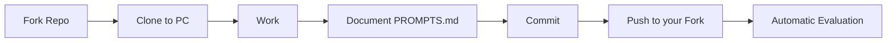

# Git and GitHub

Guides for working with Git and GitHub in this course.

## What will you find here?

### [Fork and Clone](fork-clone.md)

Learn how to create your copy of the repository and clone it to your computer:

- What is a Fork and why do you need it
- How to Fork the repository
- How to clone your Fork to your PC
- Configuring remotes (origin and upstream)

### [Sync Fork](sincronizar-fork.md)

Keep your Fork up to date with the professor's new exercises:

- Why your Fork does NOT update automatically
- How to sync from GitHub Web (easy)
- How to sync from Terminal (complete)
- Resolving merge conflicts
- Visual diagrams of the complete workflow

### [Useful Commands](comandos-utiles.md)

Git cheatsheet for daily use:

- Basic commands
- Advanced commands
- Useful shortcuts
- Solving common problems

---

## Workflow (No Pull Request)



!!! success "Simplified system"
    **You don't need to create a Pull Request.** The system evaluates your `PROMPTS.md`
    automatically. Just upload your work with `git push`.

---

## Basic Concepts

### Git vs GitHub

!!! info "Git"
    **Git** is a version control system that runs on your computer. It allows you to:

    - Save versions of your code
    - Revert to previous versions
    - Work on multiple branches
    - Collaborate with others

!!! info "GitHub"
    **GitHub** is a cloud platform where you store your code. It allows you to:

    - Share code publicly
    - Collaborate with other developers
    - Host projects
    - Manage projects and collaboration

```
┌─────────────────────────────────────────────────────────────┐
│                  GIT vs GITHUB                              │
├─────────────────────────────────────────────────────────────┤
│                                                              │
│  GIT (Program on your PC)                                   │
│  ┌──────────────────────────────────────┐                 │
│  │  Your computer                       │                 │
│  │  ┌─────────────────────────────────┐ │                 │
│  │  │  📁 Folder with your code       │ │                 │
│  │  │  ├── exercise1.py               │ │                 │
│  │  │  ├── exercise2.py               │ │                 │
│  │  │  └── .git/  ← Local history     │ │                 │
│  │  └─────────────────────────────────┘ │                 │
│  └──────────────────────────────────────┘                 │
│                      │                                       │
│                      │ git push (upload)                    │
│                      ↓                                       │
│  GITHUB (On the Internet)                                  │
│  ┌──────────────────────────────────────┐                 │
│  │  🌐 github.com                        │                 │
│  │  ┌─────────────────────────────────┐ │                 │
│  │  │  📦 Your online repository      │ │                 │
│  │  │  (Visible in the browser)       │ │                 │
│  │  └─────────────────────────────────┘ │                 │
│  └──────────────────────────────────────┘                 │
│                                                              │
└─────────────────────────────────────────────────────────────┘
```

---

## First Steps

!!! tip "Never used Git?"
    Start with [Fork and Clone](fork-clone.md) where we explain everything from scratch.

!!! info "Already have the repository cloned?"
    Learn how to [Sync your Fork](sincronizar-fork.md) to get new exercises.

!!! success "Completed an exercise?"
    Just do `git push` to your fork. Read the [Submission Guide](../entregas/guia-entregas.md).

---

## Help and Resources

### Common Problems

Check the [Useful Commands](comandos-utiles.md) section where you will find solutions to common problems such as:

- "fatal: not a git repository"
- "Your branch is behind origin/main"
- "CONFLICT (content): Merge conflict"
- "Permission denied (publickey)"

### External Resources

- [Git Handbook](https://guides.github.com/introduction/git-handbook/)
- [GitHub Guides](https://guides.github.com/)
- [Atlassian Git Tutorial](https://www.atlassian.com/git/tutorials)
- [Oh Shit, Git!?!](https://ohshitgit.com/) - For when things go wrong
