# Sync Your Fork

!!! warning "IMPORTANT"
    Your fork does NOT update automatically. You must sync it manually to get the new exercises the professor adds.

!!! info "Evaluation System"
    Pull Requests are NO longer used. The system evaluates your `PROMPTS.md` directly in your fork.
    See the [Submission Guide](../entregas/guia-entregas.md) for more details.

---

## The Problem

When you fork, you get a **copy at that moment**. During the course I will add new exercises, but **your fork does NOT update on its own**.


https://github.com/YOUR_USERNAME/ejercicios-bigdata
```

**Step 2:** Look for the sync banner

When there are new changes, you will see a banner like this:

!!! example "Banner on GitHub"
    ```
    ⚠️ This branch is 15 commits behind TodoEconometria:main

    [Sync fork ▼]  ← CLICK HERE
    ```

**Step 3:** Click on "Sync fork" → "Update branch"

!!! example "Sync options"
    **Sync fork**

    This will update your branch with the latest changes from TodoEconometria:main

    **[Update branch]** ← CLICK HERE
    [Discard commits]

**Step 4:** Update your local copy

Now your fork on GitHub is up to date, but your PC is not. Run:

```bash
git checkout main
git pull origin main
```

**Step 5:** Bring changes to your working branch

```bash
# Go to your exercise branch
git checkout your-lastname-exercise

# Bring changes from main
git merge main

# Push to GitHub
git push origin your-lastname-exercise
```

:white_check_mark: **Done!** You have the new exercises without losing your work.

---

## Visual Diagram of the Flow

### How synchronization works

```mermaid
%%{init: {'theme':'base', 'themeVariables': { 'fontSize':'14px'}}}%%
sequenceDiagram
    actor You
    participant Local as 💻 Your PC<br/>(main: 01, 02)
    participant YourBranch as 💻 Your PC<br/>(your-branch: 01, 02 + YOUR CODE)
    participant Origin as 🌐 Your Fork GitHub<br/>(01, 02)
    participant Upstream as 👨‍🏫 Professor's Repo<br/>(01, 02, 03, 04, 05)

    Note over You,Upstream: INITIAL STATE - Your fork is outdated

    rect rgb(255, 243, 224)
    Note over You,Upstream: STEP 1: Switch to main branch
    You->>Local: git checkout main
    activate Local
    Note over Local: Now you are on main
    end

    rect rgb(232, 245, 233)
    Note over You,Upstream: STEP 2: Download and merge professor's changes
    You->>Upstream: git fetch upstream
    Upstream-->>Local: Downloads [03, 04, 05]
    You->>Local: git merge upstream/main
    Note over Local: main: 01, 02, 03, 04, 05 ✅
    deactivate Local
    end

    rect rgb(237, 231, 246)
    Note over You,Upstream: STEP 3: Switch to your working branch
    You->>YourBranch: git checkout your-branch
    activate YourBranch
    Note over YourBranch: Now you are on your-branch
    end

    rect rgb(255, 249, 196)
    Note over You,Upstream: STEP 4: Bring changes to your branch
    You->>YourBranch: git merge main
    Note over YourBranch: your-branch: 01-05 + YOUR CODE ✅
    deactivate YourBranch
    end

    rect rgb(225, 245, 254)
    Note over You,Upstream: STEP 5: Push everything to GitHub
    You->>Origin: git push origin your-branch
    Note over Origin: your-branch: 01-05 + YOUR CODE ✅
    end

    rect rgb(200, 230, 201)
    Note over You,Upstream: ✅ RESULT - You have everything without losing your work
    end
```



---

## Simplified View of the Process

```mermaid
%%{init: {'theme':'base', 'themeVariables': { 'primaryColor':'#e1f5ff','primaryTextColor':'#000','primaryBorderColor':'#0277bd','secondaryColor':'#fff9c4','tertiaryColor':'#e8f5e9','noteBkgColor':'#fff3e0','noteTextColor':'#000'}}}%%
flowchart TB
    subgraph Before["❌ BEFORE - Outdated"]
        direction LR
        A1["👨‍🏫 Professor's Repo<br/><br/>📦 Exercises:<br/>[01] [02] [03] [04] [05]"]
        A2["🌐 Your Fork<br/><br/>📦 Your exercises:<br/>[01] [02]<br/><br/>⚠️ You are missing 3 exercises"]
        A3["💻 Your PC<br/><br/>📂 your-branch:<br/>[01] [02] + YOUR CODE"]
    end

    subgraph Process["🔄 SYNC PROCESS"]
        direction TB
        P1["① git fetch upstream<br/>Download professor's changes"]
        P2["② git merge upstream/main<br/>Apply to your local main"]
        P3["③ git merge main<br/>Bring to your working branch"]
        P4["④ git push origin your-branch<br/>Push everything to GitHub"]

        P1 --> P2 --> P3 --> P4
    end

    subgraph After["✅ AFTER - Up to date"]
        direction LR
        D1["👨‍🏫 Professor's Repo<br/><br/>📦 Exercises:<br/>[01] [02] [03] [04] [05]"]
        D2["🌐 Your Fork<br/><br/>📦 Your exercises:<br/>[01-05] + YOUR CODE<br/><br/>✅ Fully up to date"]
        D3["💻 Your PC<br/><br/>📂 your-branch:<br/>[01-05] + YOUR CODE<br/><br/>🎯 Ready to work"]
    end

    Before --> Process --> After

    style A1 fill:#e1f5ff,stroke:#0277bd,stroke-width:2px
    style A2 fill:#ffebee,stroke:#c62828,stroke-width:2px
    style A3 fill:#fff3e0,stroke:#ef6c00,stroke-width:2px

    style P1 fill:#e3f2fd,stroke:#1976d2,stroke-width:2px
    style P2 fill:#e8f5e9,stroke:#388e3c,stroke-width:2px
    style P3 fill:#f3e5f5,stroke:#7b1fa2,stroke-width:2px
    style P4 fill:#fff9c4,stroke:#f57f17,stroke-width:2px

    style D1 fill:#e1f5ff,stroke:#0277bd,stroke-width:2px
    style D2 fill:#c8e6c9,stroke:#2e7d32,stroke-width:3px
    style D3 fill:#c8e6c9,stroke:#2e7d32,stroke-width:3px
```



---

## Detailed Method (Terminal)

### Situation

You are working on a branch (example: `garcia-ejercicio-1.1`) and the professor added new exercises.

**Goal:** Bring the new exercises WITHOUT losing your work.

### STEP 1: Save your current work

```bash
# See which files you changed
git status

# Save your changes
git add entregas/01_bases_de_datos/your_lastname_firstname/
git commit -m "Save my progress"
```

### STEP 2: Go to your main branch

```bash
git checkout main
```

### STEP 3: Download the professor's changes

```bash
git fetch upstream
git merge upstream/main
```

Now your local `main` has the new exercises :white_check_mark:

### STEP 4: Go back to your working branch

```bash
git checkout garcia-ejercicio-1.1
```

(Replace `garcia-ejercicio-1.1` with YOUR branch name)

### STEP 5: Bring the new exercises to your branch

```bash
git merge main
```

!!! info "What does this do?"
    It combines the professor's new exercises with your work. **It does NOT delete anything of yours.**

### STEP 6: Push to GitHub

```bash
git push origin garcia-ejercicio-1.1
```

:white_check_mark: **Done!** You have the new exercises AND your work intact.

---

## What Happens When the Professor Adds Exercises?

```mermaid
%%{init: {'theme':'base', 'themeVariables': { 'git0':'#e1f5ff','git1':'#fff9c4','git2':'#ffebee'}}}%%
gitGraph
    commit id: "01: Intro SQLite" tag: "Week 1"
    commit id: "02: Data Cleaning"
    branch your-fork
    checkout your-fork
    commit id: "✅ You Forked" type: HIGHLIGHT

    checkout main
    commit id: "03: Dask & Parquet" tag: "Week 3"
    commit id: "04: PySpark"
    commit id: "05: Dashboard"

    checkout your-fork
    commit id: "❌ Outdated" type: REVERSE
    commit id: "⚠️ Missing 03, 04, 05" type: REVERSE
```



!!! warning "The fork does NOT update automatically"
    When the professor adds new exercises to the original repository, **your fork on GitHub does NOT receive those changes automatically**. You must sync it manually following the steps in this guide.

---

## Golden Rule to Avoid Problems

```mermaid
%%{init: {'theme':'base'}}%%
flowchart LR
    subgraph Good["✅ GOOD - Edit only here"]
        direction TB
        B1["📁 entregas/01_bases_de_datos/your_lastname_firstname/<br/><br/>├── 1.1_sqlite/<br/>│   ├── ANALISIS_DATOS.md<br/>│   ├── resumen_eda.md<br/>│   └── REFLEXION.md<br/><br/>✅ Make your changes here"]
    end

    subgraph Bad["❌ BAD - DO NOT touch this"]
        direction TB
        M1["📁 ejercicios/01_bases_de_datos/<br/><br/>├── README.md ← DO NOT TOUCH<br/>├── eda_exploratorio.py ← Only run<br/><br/>🔒 Professor's files"]
    end

    Good -.->|No conflicts| OK["🎉 Perfect<br/>sync"]
    Bad -.->|Causes conflicts| NOK["⚠️ Problems<br/>when syncing"]

    style Good fill:#c8e6c9,stroke:#2e7d32,stroke-width:3px
    style Bad fill:#ffcdd2,stroke:#c62828,stroke-width:3px
    style B1 fill:#e8f5e9,stroke:#388e3c,stroke-width:2px
    style M1 fill:#ffebee,stroke:#d32f2f,stroke-width:2px
    style OK fill:#a5d6a7,stroke:#43a047,stroke-width:2px
    style NOK fill:#ef9a9a,stroke:#e53935,stroke-width:2px
```



!!! success "Golden Rule"
    **If you only edit files in `entregas/YOUR_FOLDER/`, you will NEVER have conflicts.**

    The professor updates `ejercicios/`, you work in `entregas/`. Zero problems.

---

## What do I do if Git says "CONFLICT"?

### Step 1: Git will tell you which file has the conflict

```bash
Auto-merging ejercicio_01.py
CONFLICT (content): Merge conflict in ejercicio_01.py
Automatic merge failed; fix conflicts and then commit the result.
```

### Step 2: Open the file

You will see something like this:

```python
<<<<<<< HEAD
your code here
=======
professor's code
>>>>>>> main
```

### Step 3: Decide what to keep

- If it's a professor's file you should NOT have touched → Keep the professor's version
- If it's YOUR submission file → Keep your version

### Step 4: Delete the markers

Remove these lines:

```
<<<<<<< HEAD
=======
>>>>>>> main
```

### Step 5: Finish the merge

```bash
git add filename
git commit -m "Resolve conflict"
git push origin your-branch
```

!!! tip "Tip"
    If you only work in `entregas/YOUR_FOLDER/`, this will never happen to you.

---

## Ultra-Quick Summary

```bash
# 1. Save your work
git add .
git commit -m "Save progress"

# 2. Update main
git checkout main
git fetch upstream
git merge upstream/main

# 3. Go back to your branch and bring changes
git checkout your-branch
git merge main

# 4. Push
git push origin your-branch
```

**Frequency:** Do this every Monday before class.

---

## Sync Best Practices

### 1. Sync BEFORE starting a new exercise

```bash
# ✅ GOOD - Sync first
git fetch upstream && git merge upstream/main
# Now start working

# ❌ BAD - Working with old code
# You start without updating, then you get conflicts
```

### 2. Commit your work BEFORE syncing

```bash
# ✅ GOOD - Save your work first
git add .
git commit -m "Progress on exercise 03"
git fetch upstream && git merge upstream/main

# ❌ BAD - Syncing with unsaved changes
# You might lose your work
```

### 3. Recommended frequency

```mermaid
%%{init: {'theme':'base'}}%%
gantt
    title 📅 Weekly Sync Schedule
    dateFormat YYYY-MM-DD
    section Monday
    Sync before class :milestone, m1, 2024-01-01, 0d
    git fetch upstream :active, 2024-01-01, 1h
    git merge upstream/main :active, 2024-01-01, 30m
    section Tuesday to Thursday
    Work on exercises :2024-01-02, 3d
    Local commits :2024-01-02, 3d
    section Friday
    Push your progress :milestone, m2, 2024-01-05, 0d
    git push origin your-branch :crit, 2024-01-05, 1h
    section Sunday
    Check for updates (optional) :done, 2024-01-07, 30m
```



!!! tip "Frequency recommendation"
    - **Monday**: Sync before class to get the latest exercises
    - **During the week**: Work normally, make frequent commits
    - **Friday**: Push your progress to GitHub
    - **Sunday (optional)**: Check if there are new updates

---

## Check Sync Status

### Useful command to know if you are outdated

```bash
# See differences between your fork and the professor's repo
git fetch upstream
git log HEAD..upstream/main --oneline
```

**If you see new commits:**

```
a1b2c3d Add exercise 06
d4e5f6g Fix typo in exercise 05
g7h8i9j Add data for exercise 06
```

It means you have 3 commits (exercises/updates) that you don't have.

**If you see nothing:**

```
(empty)
```

It means you are up to date. :white_check_mark:

---

## Next Steps

Now that you know how to sync your fork:

- [Submission Guide](../entregas/guia-entregas.md) - How to submit exercises
- [Useful Commands](comandos-utiles.md) - Git Cheatsheet
- [Fork and Clone](fork-clone.md) - If you need to review the basic concepts
