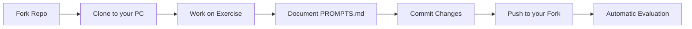

# Your First Exercise

This guide will take you step by step through the process of completing and submitting your first exercise.

## General Workflow



!!! warning "PROMPTS-Based Evaluation System"
    **Pull Requests are NOT used.** The system evaluates your `PROMPTS.md` file
    directly in your fork. You only need to do `git push`.

---

## Step 1: Open the Project in PyCharm

1. Open PyCharm
2. File → Open...
3. Select the `ejercicios-bigdata/` folder
4. Click "OK"

!!! tip "First time in PyCharm?"
    PyCharm will ask if you trust the project. Click "Trust Project".

---

## Step 2: Configure the Python Interpreter

PyCharm should automatically detect the virtual environment. If it doesn't:

1. File → Settings (Windows/Linux) or PyCharm → Preferences (macOS)
2. Project: ejercicios-bigdata → Python Interpreter
3. Click the gear icon → Add
4. Select "Existing environment"
5. Browse to `.venv/Scripts/python.exe` (Windows) or `.venv/bin/python` (macOS/Linux)
6. Click "OK"

---

## Step 3: Navigate to Your First Exercise

In PyCharm's file explorer:

```
ejercicios-bigdata/
└── ejercicios/
    └── 01_cargar_sqlite.py  ← Open this file
```

!!! info "Exercise Structure"
    Each exercise has:

    - **Base code:** `.py` file with instructions
    - **Data:** `datos/` folder with datasets
    - **README:** Detailed explanation of the exercise

---

## Step 4: Read the Problem Statement

**IMPORTANT:** Read the ENTIRE file before you start coding.

The exercise will have sections like:

```python
"""
Exercise 01: Data Loading with SQLite

OBJECTIVE:
Learn to load data from CSV into an SQLite database

DATASET:
- File: datos/muestra_taxi.csv
- Size: ~10MB
- Records: ~100,000

TASKS:
1. Load CSV in chunks into SQLite
2. Create indexes to optimize queries
3. Run analysis queries
4. Export results

ESTIMATED TIME: 2-3 hours
"""
```

---

## Step 5: Create a Working Branch

**NEVER work directly on `main`**. Always create a branch:

```bash
# Make sure you are on main and up to date
git checkout main
git pull origin main

# Create a branch with your last name and exercise number
git checkout -b garcia-ejercicio-01

# Verify you are on the correct branch
git branch
# Should show: * garcia-ejercicio-01
```

!!! tip "Branch Naming Convention"
    Use the format: `your-lastname-exercise-XX`

    Examples:
    - `garcia-ejercicio-01`
    - `martinez-ejercicio-02`

---

## Step 6: Work on the Exercise

### Edit the Code

Open `ejercicios/01_cargar_sqlite.py` and start working.

!!! example "Code Example"

    ```python
    import sqlite3
    import pandas as pd

    # Task 1: Load CSV in chunks
    def cargar_datos_sqlite(csv_path, db_path, chunksize=10000):
        """
        Loads a large CSV into SQLite in chunks to avoid memory issues
        """
        conn = sqlite3.connect(db_path)

        # Read CSV in parts
        chunks = pd.read_csv(csv_path, chunksize=chunksize)

        for i, chunk in enumerate(chunks):
            chunk.to_sql('trips', conn, if_exists='append', index=False)
            print(f"Chunk {i+1} loaded ({len(chunk)} records)")

        conn.close()
        print("Loading complete!")

    # Execute
    if __name__ == "__main__":
        cargar_datos_sqlite(
            csv_path='datos/muestra_taxi.csv',
            db_path='datos/taxi.db'
        )
    ```

### Test Your Code

Run your code frequently to verify it works:

=== "From PyCharm"

    1. Right-click on the file
    2. Run 'ejercicio_01'
    3. Or press `Shift + F10`

=== "From Terminal"

    ```bash
    # Make sure the virtual environment is activated
    python ejercicios/01_cargar_sqlite.py
    ```

!!! tip "Debug Frequently"
    Don't write all the code at once. Write a function, test it, and continue.

---

## Step 7: Save Your Work with Git

When you have significant progress (for example, you completed a task):

```bash
# See which files you changed
git status

# Add the modified files
git add ejercicios/01_cargar_sqlite.py

# Commit with a descriptive message
git commit -m "Implement CSV to SQLite chunk loading"

# Continue working...
```

!!! success "Good Commit Messages"
    **GOOD:**
    - "Implement CSV to SQLite chunk loading"
    - "Add indexes to optimize queries"
    - "Complete revenue analysis by hour"

    **BAD:**
    - "update"
    - "fix"
    - "asdfasdf"

---

## Step 8: Push to GitHub

When you have completed the exercise:

```bash
# Make a final commit
git add .
git commit -m "Complete exercise 01: SQLite data loading"

# Push your branch to GitHub
git push origin garcia-ejercicio-01
```

!!! info "First time pushing?"
    Git will ask for authentication. Use your GitHub username and password, or configure SSH keys.

---

## Step 9: Verify Your Submission

1. Go to your fork on GitHub: `https://github.com/YOUR_USERNAME/ejercicios-bigdata`
2. Navigate to your submission folder
3. Verify that all your files are there, especially `PROMPTS.md`

!!! success "Submission Completed"
    You don't need to do anything else. The system evaluates your `PROMPTS.md` automatically.

---

## Step 10: The PROMPTS.md File

**This is the most important file of your submission.**

Document your AI prompts as you work:

```markdown
# AI Prompts - Exercise 01

## Prompt A: Load data into SQLite

**AI used:** ChatGPT / Claude / etc.

**Exact prompt:**
> how do i load a large csv into sqlite using python with chunks

---

## Prompt B: Optimize queries

[Same format...]

---

## Final Blueprint

[When finished, ask the AI for a summary of what you built]
```

!!! danger "DO NOT clean your prompts"
    Paste your prompts EXACTLY as you wrote them, with errors and all.
    The system detects if they were "cleaned".

---

## Best Practices

### Clean Code

```python
# ✅ GOOD - Readable code with comments
def calcular_promedio_tarifas(db_path):
    """
    Calculates the average fare by hour of day

    Args:
        db_path: Path to the SQLite database

    Returns:
        DataFrame with average fares by hour
    """
    conn = sqlite3.connect(db_path)

    query = """
        SELECT
            strftime('%H', pickup_datetime) as hora,
            AVG(total_amount) as promedio_tarifa
        FROM trips
        GROUP BY hora
        ORDER BY hora
    """

    resultado = pd.read_sql_query(query, conn)
    conn.close()

    return resultado

# ❌ BAD - No documentation, confusing names
def calc(p):
    c = sqlite3.connect(p)
    r = pd.read_sql_query("SELECT strftime('%H', pickup_datetime) as h, AVG(total_amount) as t FROM trips GROUP BY h", c)
    c.close()
    return r
```

### Atomic Commits

Make small and specific commits:

```bash
# ✅ GOOD - Small and descriptive commits
git commit -m "Add data loading function"
git commit -m "Implement index creation"
git commit -m "Add analysis queries"

# ❌ BAD - One giant commit
git commit -m "Entire exercise"
```

### Test Before Uploading

```bash
# Always verify it works before pushing
python ejercicios/01_cargar_sqlite.py

# If it works, then push
git push origin garcia-ejercicio-01
```

---

## Exercise Checklist

Before uploading your work (git push), verify:

- [ ] The code runs without errors
- [ ] All exercise tasks are complete
- [ ] The code is documented (comments, docstrings)
- [ ] Commits have descriptive messages
- [ ] The code follows Python best practices
- [ ] You tested with the complete dataset

---

## Common Problems

??? question "Error: ModuleNotFoundError: No module named 'pandas'"

    **Cause:** Virtual environment not activated or dependencies not installed.

    **Solution:**

    ```bash
    # Activate virtual environment
    source .venv/bin/activate  # macOS/Linux
    .venv\Scripts\activate      # Windows

    # Install dependencies
    pip install -r requirements.txt
    ```

??? question "Git says: 'Your branch is behind origin/main'"

    **Cause:** Your local main branch is outdated.

    **Solution:**

    ```bash
    git checkout main
    git pull origin main
    git checkout garcia-ejercicio-01
    git merge main
    ```

??? question "Cannot push: 'Permission denied'"

    **Cause:** Authentication issues with GitHub.

    **Solution:** Configure SSH keys or use a Personal Access Token.

    See: [GitHub Authentication](https://docs.github.com/en/authentication)

??? question "PyCharm can't find the data"

    **Cause:** Incorrect relative path.

    **Solution:** Use relative paths from the project root:

    ```python
    # ✅ CORRECT
    csv_path = 'datos/muestra_taxi.csv'

    # ❌ WRONG
    csv_path = '../datos/muestra_taxi.csv'
    ```

---

## Next Steps

Once you have completed your first exercise:

- [Sync Fork](../git-github/sincronizar-fork.md) - Keep your fork up to date
- [Course Roadmap](roadmap.md) - See all available exercises
- [Useful Commands](../git-github/comandos-utiles.md) - Git Cheatsheet
