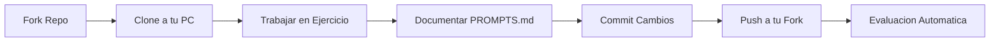

# Tu Primer Ejercicio

Esta guia te llevara paso a paso por el proceso de completar y entregar tu primer ejercicio.

## Flujo de Trabajo General



!!! warning "Sistema de Evaluacion por PROMPTS"
    **NO se usan Pull Requests.** El sistema evalua tu archivo `PROMPTS.md`
    directamente en tu fork. Solo necesitas hacer `git push`.

---

## Paso 1: Abrir el Proyecto en PyCharm

1. Abre PyCharm
2. File → Open...
3. Selecciona la carpeta `ejercicios-bigdata/`
4. Click en "OK"

!!! tip "Primera vez en PyCharm?"
    PyCharm te preguntara si confias en el proyecto. Click en "Trust Project".

---

## Paso 2: Configurar el Interprete de Python

PyCharm debe detectar automaticamente el entorno virtual. Si no lo hace:

1. File → Settings (Windows/Linux) o PyCharm → Preferences (macOS)
2. Project: ejercicios-bigdata → Python Interpreter
3. Click en el icono de engranaje → Add
4. Selecciona "Existing environment"
5. Busca `.venv/Scripts/python.exe` (Windows) o `.venv/bin/python` (macOS/Linux)
6. Click "OK"

---

## Paso 3: Navegar a Tu Primer Ejercicio

En el explorador de archivos de PyCharm:

```
ejercicios-bigdata/
└── ejercicios/
    └── 01_cargar_sqlite.py  ← Abre este archivo
```

!!! info "Estructura del Ejercicio"
    Cada ejercicio tiene:

    - **Codigo base:** Archivo `.py` con instrucciones
    - **Datos:** Carpeta `datos/` con los datasets
    - **README:** Explicacion detallada del ejercicio

---

## Paso 4: Leer el Enunciado

**IMPORTANTE:** Lee TODO el archivo antes de empezar a codear.

El ejercicio tendra secciones como:

```python
"""
Ejercicio 01: Carga de Datos con SQLite

OBJETIVO:
Aprender a cargar datos desde CSV a una base de datos SQLite

DATASET:
- Archivo: datos/muestra_taxi.csv
- Tamano: ~10MB
- Registros: ~100,000

TAREAS:
1. Cargar CSV en chunks a SQLite
2. Crear indices para optimizar queries
3. Ejecutar queries de analisis
4. Exportar resultados

TIEMPO ESTIMADO: 2-3 horas
"""
```

---

## Paso 5: Crear una Rama de Trabajo

**NUNCA trabajes directamente en `main`**. Siempre crea una rama:

```bash
# Asegurate de estar en main y actualizado
git checkout main
git pull origin main

# Crea una rama con tu apellido y el numero de ejercicio
git checkout -b garcia-ejercicio-01

# Verifica que estas en la rama correcta
git branch
# Debera mostrar: * garcia-ejercicio-01
```

!!! tip "Nomenclatura de Ramas"
    Usa el formato: `tu-apellido-ejercicio-XX`

    Ejemplos:
    - `garcia-ejercicio-01`
    - `martinez-ejercicio-02`

---

## Paso 6: Trabajar en el Ejercicio

### Editar el Codigo

Abre `ejercicios/01_cargar_sqlite.py` y empieza a trabajar.

!!! example "Ejemplo de Codigo"

    ```python
    import sqlite3
    import pandas as pd

    # Tarea 1: Cargar CSV en chunks
    def cargar_datos_sqlite(csv_path, db_path, chunksize=10000):
        """
        Carga un CSV grande a SQLite en chunks para evitar problemas de memoria
        """
        conn = sqlite3.connect(db_path)

        # Leer CSV por partes
        chunks = pd.read_csv(csv_path, chunksize=chunksize)

        for i, chunk in enumerate(chunks):
            chunk.to_sql('trips', conn, if_exists='append', index=False)
            print(f"Chunk {i+1} cargado ({len(chunk)} registros)")

        conn.close()
        print("Carga completa!")

    # Ejecutar
    if __name__ == "__main__":
        cargar_datos_sqlite(
            csv_path='datos/muestra_taxi.csv',
            db_path='datos/taxi.db'
        )
    ```

### Probar tu Codigo

Ejecuta tu codigo frecuentemente para verificar que funciona:

=== "Desde PyCharm"

    1. Click derecho en el archivo
    2. Run 'ejercicio_01'
    3. O presiona `Shift + F10`

=== "Desde Terminal"

    ```bash
    # Asegurate de tener el entorno virtual activado
    python ejercicios/01_cargar_sqlite.py
    ```

!!! tip "Debug Frecuente"
    No escribas todo el codigo de una vez. Escribe una funcion, pruebalas, y continua.

---

## Paso 7: Guardar tu Trabajo con Git

Cuando tengas un avance significativo (por ejemplo, completaste una tarea):

```bash
# Ver que archivos cambiaste
git status

# Agregar los archivos modificados
git add ejercicios/01_cargar_sqlite.py

# Hacer commit con un mensaje descriptivo
git commit -m "Implementar carga de CSV a SQLite en chunks"

# Continua trabajando...
```

!!! success "Buenos Mensajes de Commit"
    ✅ **BIEN:**
    - "Implementar carga de CSV a SQLite en chunks"
    - "Agregar indices para optimizar queries"
    - "Completar analisis de ingresos por hora"

    ❌ **MAL:**
    - "update"
    - "fix"
    - "asdfasdf"

---

## Paso 8: Subir a GitHub

Cuando hayas completado el ejercicio:

```bash
# Hacer un commit final
git add .
git commit -m "Completar ejercicio 01: carga de datos SQLite"

# Subir tu rama a GitHub
git push origin garcia-ejercicio-01
```

!!! info "Primera vez haciendo push?"
    Git te pedira autenticacion. Usa tu usuario y password de GitHub, o configura SSH keys.

---

## Paso 9: Verificar tu Entrega

1. Ve a tu fork en GitHub: `https://github.com/TU_USUARIO/ejercicios-bigdata`
2. Navega a tu carpeta de entrega
3. Verifica que estan todos tus archivos, especialmente `PROMPTS.md`

!!! success "Entrega Completada"
    No necesitas hacer nada mas. El sistema evalua tu `PROMPTS.md` automaticamente.

---

## Paso 10: El Archivo PROMPTS.md

**Este es el archivo mas importante de tu entrega.**

Documenta tus prompts de IA mientras trabajas:

```markdown
# Prompts de IA - Ejercicio 01

## Prompt A: Cargar datos a SQLite

**IA usada:** ChatGPT / Claude / etc.

**Prompt exacto:**
> como cargo un csv grande a sqlite usando python con chunks

---

## Prompt B: Optimizar queries

[Mismo formato...]

---

## Blueprint Final

[Al terminar, pide a la IA un resumen de lo que construiste]
```

!!! danger "NO limpies tus prompts"
    Pega tus prompts TAL CUAL los escribiste, con errores y todo.
    El sistema detecta si fueron "limpiados".

---

## Mejores Practicas

### Codigo Limpio

```python
# ✅ BIEN - Codigo legible con comentarios
def calcular_promedio_tarifas(db_path):
    """
    Calcula el promedio de tarifas por hora del dia

    Args:
        db_path: Ruta a la base de datos SQLite

    Returns:
        DataFrame con promedio de tarifas por hora
    """
    conn = sqlite3.connect(db_path)

    query = """
        SELECT
            strftime('%H', pickup_datetime) as hora,
            AVG(total_amount) as promedio_tarifa
        FROM trips
        GROUP BY hora
        ORDER BY hora
    """

    resultado = pd.read_sql_query(query, conn)
    conn.close()

    return resultado

# ❌ MAL - Sin documentacion, nombres confusos
def calc(p):
    c = sqlite3.connect(p)
    r = pd.read_sql_query("SELECT strftime('%H', pickup_datetime) as h, AVG(total_amount) as t FROM trips GROUP BY h", c)
    c.close()
    return r
```

### Commits Atomicos

Haz commits pequenos y especificos:

```bash
# ✅ BIEN - Commits pequenos y descriptivos
git commit -m "Agregar funcion de carga de datos"
git commit -m "Implementar creacion de indices"
git commit -m "Agregar queries de analisis"

# ❌ MAL - Un solo commit gigante
git commit -m "Todo el ejercicio"
```

### Probar Antes de Subir

```bash
# Siempre verifica que funciona antes de push
python ejercicios/01_cargar_sqlite.py

# Si funciona, entonces push
git push origin garcia-ejercicio-01
```

---

## Checklist del Ejercicio

Antes de subir tu trabajo (git push), verifica:

- [ ] El codigo ejecuta sin errores
- [ ] Todas las tareas del ejercicio estan completas
- [ ] El codigo esta documentado (comentarios, docstrings)
- [ ] Los commits tienen mensajes descriptivos
- [ ] El codigo sigue las mejores practicas de Python
- [ ] Probaste con el dataset completo

---

## Problemas Comunes

??? question "Error: ModuleNotFoundError: No module named 'pandas'"

    **Causa:** Entorno virtual no activado o dependencias no instaladas.

    **Solucion:**

    ```bash
    # Activar entorno virtual
    source .venv/bin/activate  # macOS/Linux
    .venv\Scripts\activate      # Windows

    # Instalar dependencias
    pip install -r requirements.txt
    ```

??? question "Git dice: 'Your branch is behind origin/main'"

    **Causa:** Tu rama main local esta desactualizada.

    **Solucion:**

    ```bash
    git checkout main
    git pull origin main
    git checkout garcia-ejercicio-01
    git merge main
    ```

??? question "No puedo hacer push: 'Permission denied'"

    **Causa:** Problemas de autenticacion con GitHub.

    **Solucion:** Configura SSH keys o usa Personal Access Token.

    Ver: [GitHub Authentication](https://docs.github.com/en/authentication)

??? question "PyCharm no encuentra los datos"

    **Causa:** Ruta relativa incorrecta.

    **Solucion:** Usa rutas relativas desde la raiz del proyecto:

    ```python
    # ✅ BIEN
    csv_path = 'datos/muestra_taxi.csv'

    # ❌ MAL
    csv_path = '../datos/muestra_taxi.csv'
    ```

---

## Proximos Pasos

Una vez completado tu primer ejercicio:

- [Sincronizar Fork](../git-github/sincronizar-fork.md) - Mantener tu fork actualizado
- [Roadmap del Curso](roadmap.md) - Ver todos los ejercicios disponibles
- [Comandos Utiles](../git-github/comandos-utiles.md) - Cheatsheet de Git
