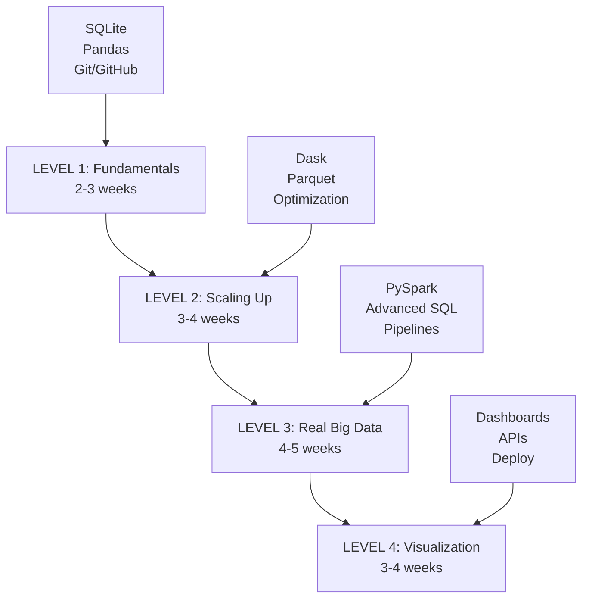
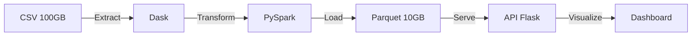
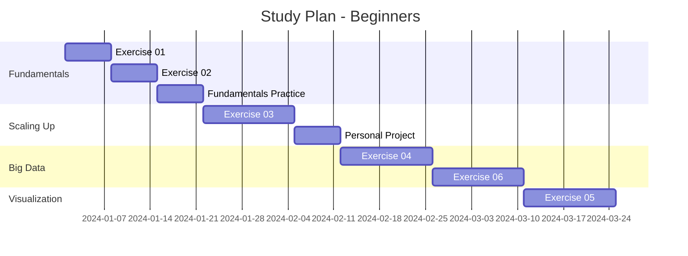
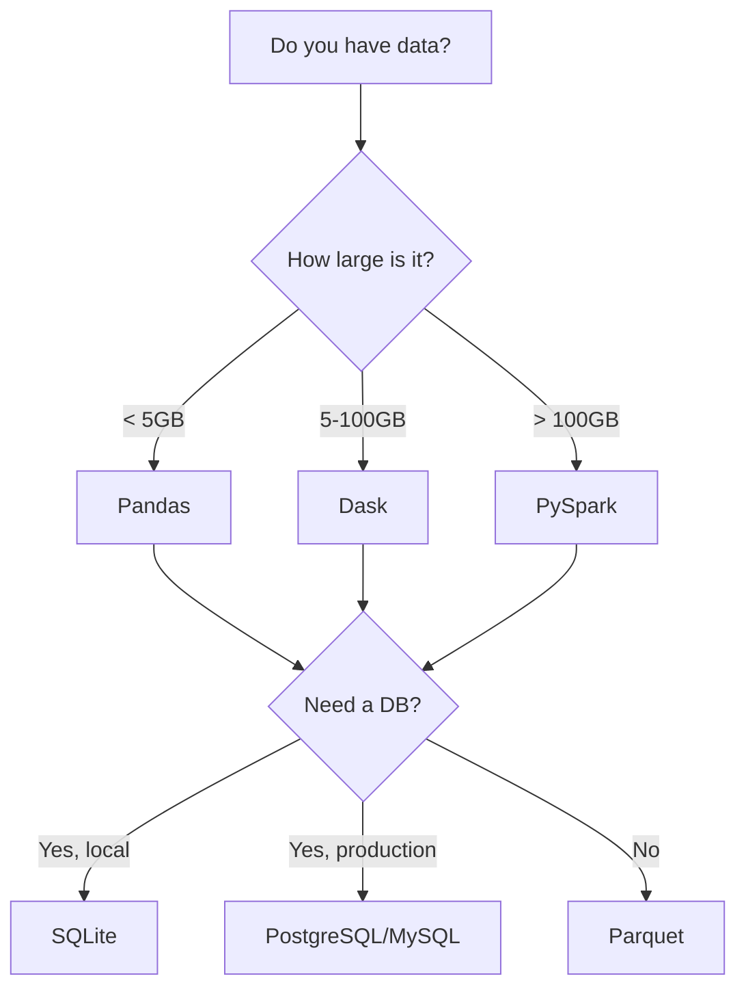

# Course Roadmap

Complete overview of all exercises, technologies, and the recommended learning plan.

## Learning Levels



---

## LEVEL 1: Fundamentals

**Duration:** 2-3 weeks | **Difficulty:** Basic

### Objectives

- Master relational databases with SQLite
- Learn data analysis with Pandas
- Understand version control with Git/GitHub

### Technologies

| Technology | Purpose | Resources |
|------------|---------|-----------|
| **SQLite** | Embedded database | [Official docs](https://www.sqlite.org/) |
| **Pandas** | In-memory data analysis | [Pandas docs](https://pandas.pydata.org/) |
| **Git** | Version control | [Git handbook](https://guides.github.com/) |

### Exercises

#### Exercise 01: Data Loading with SQLite

!!! info "Details"
    - **Estimated time:** 2-3 hours
    - **Dataset:** NYC Taxi (10MB sample)
    - **Level:** Basic

**What you will learn:**

- Load data from CSV into a database
- Basic SQL queries (SELECT, WHERE, GROUP BY)
- Optimization with indexes
- Export results

**Skills:**

- [x] Load CSV in chunks
- [x] Create SQLite database
- [x] Run SQL queries
- [x] Create indexes
- [x] Export results to CSV

#### Exercise 02: Cleaning and Transformation

!!! info "Details"
    - **Estimated time:** 3-4 hours
    - **Dataset:** NYC Taxi (dirty data)
    - **Level:** Basic

**What you will learn:**

- Detect and handle null values
- Identify outliers
- Data transformations
- Type validation

---

## LEVEL 2: Scaling Up

**Duration:** 3-4 weeks | **Difficulty:** Intermediate

### Objectives

- Process data larger than your RAM
- Understand parallel processing
- Optimize performance

### Technologies

| Technology | Purpose | When to Use |
|------------|---------|-------------|
| **Dask** | Parallel processing | Data > RAM (5-100GB) |
| **Parquet** | Columnar format | Efficient storage |
| **Optimization** | Performance | Always |

### Exercises

#### Exercise 03: Processing with Parquet and Dask

!!! info "Details"
    - **Estimated time:** 4-5 hours
    - **Dataset:** Full NYC Taxi (121MB)
    - **Level:** Intermediate

**What you will learn:**

- Why Parquet is better than CSV
- Parallel processing with Dask
- Lazy evaluation
- Memory optimization

**Format Comparison:**

| Metric | CSV | Parquet |
|--------|-----|---------|
| Disk size | 121 MB | 45 MB |
| Read time | 8.5 sec | 1.2 sec |
| Compression | No | Yes |
| Data types | Not preserved | Preserved |

---

## LEVEL 3: Real Big Data

**Duration:** 4-5 weeks | **Difficulty:** Advanced

### Objectives

- Master distributed processing
- Work with massive data (>100GB)
- Build production pipelines

### Technologies

| Technology | Purpose | Scale |
|------------|---------|-------|
| **PySpark** | Distributed processing | > 100GB |
| **Advanced SQL** | Complex queries | Any size |
| **ETL Pipelines** | Automation | Production |

### Exercises

#### Exercise 04: Complex Queries with PySpark

!!! info "Details"
    - **Estimated time:** 5-6 hours
    - **Dataset:** NYC Taxi + Weather (multiple sources)
    - **Level:** Advanced

**What you will learn:**

- Introduction to Spark
- Distributed DataFrames
- SQL in Spark
- Multi-source joins
- Data partitioning

#### Exercise 06: Complete ETL Pipeline

!!! info "Details"
    - **Estimated time:** 10-12 hours
    - **Dataset:** Multiple sources
    - **Level:** Advanced

**Pipeline Architecture:**



---

## LEVEL 4: Visualization and Deploy

**Duration:** 3-4 weeks | **Difficulty:** Advanced

### Objectives

- Create professional dashboards
- Serve data via API
- Deploy to production

### Technologies

| Technology | Purpose | Use |
|------------|---------|-----|
| **Flask** | Web backend | APIs and dashboards |
| **Chart.js** | Visualizations | Interactive charts |
| **Docker** | Containers | Deploy |

### Exercises

#### Exercise 05: Interactive Dashboard

!!! info "Details"
    - **Estimated time:** 8-10 hours
    - **Project:** NYC Taxi EDA Dashboard
    - **Level:** Advanced

**Features:**

- :bar_chart: Visualization of 10M+ records
- :calendar: Dynamic filters by date/time
- :world_map: Heat maps
- :chart_with_upwards_trend: Trend analysis

**Tech Stack:**

```
Frontend: HTML + Bootstrap + Chart.js
Backend:  Flask + Pandas/Dask
Data:     SQLite/Parquet
Deploy:   Docker
```

---

## Recommended Study Plan

### For Beginners (10-12 weeks)



**Dedication:** 10-15 hours/week

### For Intermediate Learners (6-8 weeks)

!!! tip "Recommendation"
    If you already know Python and Pandas, you can start directly at LEVEL 2.

**Dedication:** 8-10 hours/week

### For Advanced Learners (4-5 weeks)

!!! tip "Recommendation"
    If you have already worked with Big Data, focus on the PySpark exercises and the final project.

**Dedication:** 5-8 hours/week

---

## Technologies by Exercise

| Exercise | SQLite | Pandas | Dask | PySpark | Flask | Level |
|----------|--------|--------|------|---------|-------|-------|
| 01 - SQLite | Yes | Yes | - | - | - | Basic |
| 02 - Cleaning | - | Yes | - | - | - | Basic |
| 03 - Dask | - | Yes | Yes | - | - | Intermediate |
| 04 - PySpark | - | - | Yes | Yes | - | Advanced |
| 05 - Dashboard | Yes | Yes | - | - | Yes | Advanced |
| 06 - Pipeline | - | - | Yes | Yes | Yes | Advanced |

---

## Technology Comparison

### When to use each tool?



### Comparison Table

| Data Size | Tool | Processing Time | RAM Required |
|-----------|------|-----------------|--------------|
| < 1GB | Pandas | Seconds | 2-4x data size |
| 1-5GB | Pandas | Minutes | 2-4x data size |
| 5-50GB | Dask | Minutes | Any RAM |
| 50-500GB | Dask/PySpark | Minutes-Hours | Any RAM |
| > 500GB | PySpark | Hours | Cluster |

---

## Certification and Evaluation

### For In-Person Course Students

- :white_check_mark: 230-hour certificate
- :white_check_mark: Automatic evaluation via PROMPTS.md
- :white_check_mark: Integrative final project
- :white_check_mark: Direct instructor support

### For Self-Learners

- :white_check_mark: Project portfolio on GitHub
- :white_check_mark: Code reviewable by employers
- :white_check_mark: Experience with real data
- :white_check_mark: Learn at your own pace

!!! tip "Your GitHub Is Your Certificate"
    Employers value seeing your code and projects more than a PDF. Make sure to:

    - Make clear and professional commits
    - Document your code
    - Complete exercises with quality
    - Add a personalized README to your fork

---

## Additional Resources

### Official Documentation

- [Pandas Documentation](https://pandas.pydata.org/docs/)
- [Dask Documentation](https://docs.dask.org/)
- [PySpark Documentation](https://spark.apache.org/docs/latest/api/python/)
- [SQLite Tutorial](https://www.sqlitetutorial.net/)

### Complementary Courses

- [Python for Data Science](https://www.coursera.org/specializations/python)
- [Big Data with Spark](https://www.udacity.com/course/learn-spark-at-udacity--ud2002)
- [SQL for Data Science](https://www.datacamp.com/courses/intro-to-sql-for-data-science)

### Communities

- [r/datascience](https://www.reddit.com/r/datascience/)
- [Stack Overflow - pandas](https://stackoverflow.com/questions/tagged/pandas)
- [Dask Discourse](https://dask.discourse.group/)

---

## Next Steps

Now that you know the complete roadmap:

1. [Install Tools](instalacion.md) - If you don't have them yet
2. [Your First Exercise](primer-ejercicio.md) - Start practicing
3. [Fork and Clone](../git-github/fork-clone.md) - Set up your work environment
