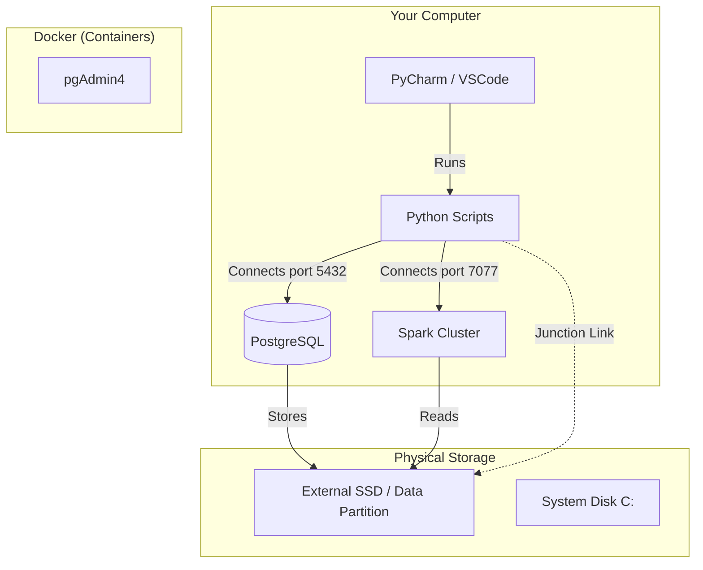

# Lab Infrastructure

> **"Prevent Big Data from crashing your main disk"**

To carry out this course, we have designed a hybrid architecture that combines the ease of use of Windows with the power of isolated Linux servers in Docker.

This guide explains **what is happening "under the hood"** when you run the installation script.

---

## Hybrid Architecture

Our environment uses three layers:

1.  **User Layer (You):** You write Python code in PyCharm/VSCode.
2.  **Compute Layer (Docker):** Heavy services (Spark, Postgres) run isolated.
3.  **Data Layer (Storage):** Massive files are stored on a dedicated disk.



---

## The Storage Dilemma (HDD vs SSD)

In Data Projects, **I/O (Disk Speed)** is critical.

### Option A: External SSD (PRO Mode)
If you have the lab configured on an external SSD (`E:\BIGDATA_LAB_STORAGE`):
1.  **Speed:** Docker has a dedicated lane for reading/writing data.
2.  **Safety:** If you download a 50GB dataset, your Windows won't run out of space.
3.  **The "Magic Tunnel" (Junction):** Windows creates a symbolic link. You see the `datos/` folder in your project, but physically the bytes are on the external SSD.

### Option B: Local Disk
If you use your main disk (`C:`):
- The system will work the same, but you must monitor free space.
- Docker and Windows will compete for disk usage (lower performance).

---

## Docker Services (The "Stack")

The `setup_cluster.ps1` script automatically launches these services:

### 1. PostgreSQL (The Data Warehouse)
*   **Why SQL:** Although we process with Spark/Dask, the final "valuable" data must reside in a structured database to be consumed by Dashboards or Analysts.
*   **Why not Mongo/Cassandra:** For this data level (structured Gigabytes), PostgreSQL is more efficient with local resources and is the gold standard for the "Serving" layer.
*   **Access:** `localhost:5432`

### 2. Apache Spark (The Processing Engine)
*   **Master + Worker:** We simulate a real cluster. The "Master" distributes tasks and the "Worker" executes them.
*   **Access:** `localhost:8081` (Dashboard)

### 3. pgAdmin 4 (The Interface)
*   A web interface to manage your SQL database without commands.
*   **Access:** `http://localhost:8080`

---

## Docker Rescue

Has Docker ever "not started" for you? The setup script includes a rescue module:
1.  Checks if the Windows service `com.docker.service` is running.
2.  If it is stopped, attempts to restart it with administrator permissions.
3.  Waits for the engine to be ready before attempting to launch the containers.

---

## How to Get Started

To launch the Docker stack, open PowerShell as Administrator and run:

```powershell
# Navigate to the project folder
cd "C:\Users\YOUR_USERNAME\Documents\ejercicios_bigdata"

# Launch the services
docker-compose up -d

# Verify they are running
docker ps
```

**Services available after starting:**
- PostgreSQL: `localhost:5432`
- Spark Master UI: `localhost:8081`
- pgAdmin: `localhost:8080`
