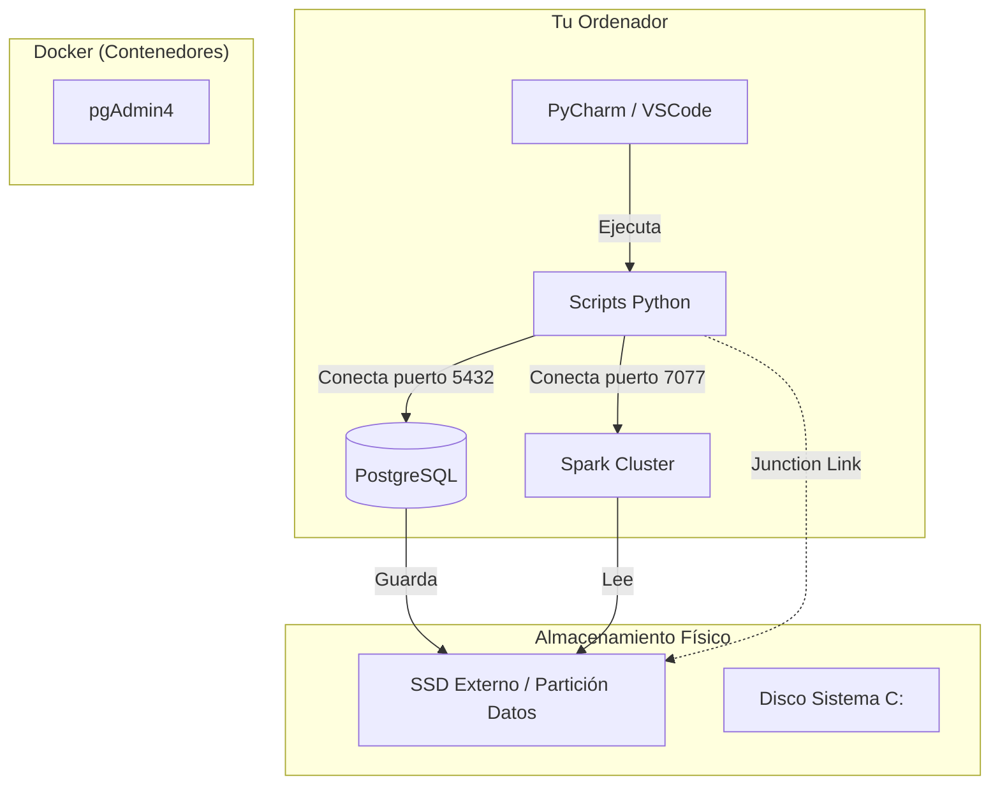

# 🏗️ Infraestructura del Laboratorio

> **"Evita que Big Data colapse tu disco principal"**

Para realizar este curso, hemos diseñado una arquitectura híbrida que combina la facilidad de uso de Windows con la potencia de servidores Linux aislados en Docker.

Esta guía te explica **qué está pasando "bajo el capó"** cuando ejecutas el script de instalación.

---

## 🧩 Arquitectura Híbrida

Nuestro entorno utiliza tres capas:

1.  **Capa de Usuario (Tú):** Escribes código Python en PyCharm/VSCode.
2.  **Capa de Cómputo (Docker):** Servicios pesados (Spark, Postgres) corren aislados.
3.  **Capa de Datos (Storage):** Los archivos masivos se guardan en un disco dedicado.



---

## 💾 El Dilema del Almacenamiento (HDD vs SSD)

En Proyectos de Datos, el **I/O (Velocidad de disco)** es crítico.

### 🚀 Opción A: SSD Externo (Modo PRO)
Si tienes el laboratorio configurado en un SSD externo (`E:\BIGDATA_LAB_STORAGE`):
1.  **Velocidad:** Docker tiene un carril exclusivo para leer/escribir datos.
2.  **Seguridad:** Si descargas un dataset de 50GB, tu Windows no se queda sin espacio.
3.  **El "Túnel Mágico" (Junction):** Windows crea un enlace simbólico. Tú ves la carpeta `datos/` en tu proyecto, pero físicamente los bytes están en el SSD externo.

### 🐢 Opción B: Disco Local
Si usas tu disco principal (`C:`):
- El sistema funcionará igual, pero debes vigilar el espacio libre.
- Docker y Windows competirán por el uso del disco (performance menor).

---

## 🐳 Servicios Docker (El "Stack")

El script `setup_cluster.ps1` levanta estos servicios automáticamente:

### 1. PostgreSQL (El Data Warehouse)
*   **Por qué SQL:** Aunque procesamos con Spark/Dask, los datos finales "de valor" deben residir en una base de datos estructurada para ser consumidos por Dashboards o Analistas.
*   **Por qué no Mongo/Cassandra:** Para este nivel de datos (Gigabytes estructurados), PostgreSQL es más eficiente en recursos locales y es el estándar de oro para la capa de "Serving".
*   **Acceso:** `localhost:5432`

### 2. Apache Spark (El Motor de Proceso)
*   **Master + Worker:** Simulamos un cluster real. El "Master" reparte tareas y el "Worker" las ejecuta.
*   **Acceso:** `localhost:8081` (Dashboard)

### 3. pgAdmin 4 (La Interfaz)
*   Una web para gestionar tu base de datos SQL sin comandos.
*   **Acceso:** `http://localhost:8080`

---

## 🚑 Docker Rescue

¿Te ha pasado que Docker "no arranca"? El script de setup incluye un módulo de rescate:
1.  Verifica si el servicio de Windows `com.docker.service` está corriendo.
2.  Si está detenido, intenta reiniciarlo con permisos de administrador.
3.  Espera a que el motor esté listo antes de intentar levantar los contenedores.

---

## 🛠️ Cómo Iniciar

Para levantar el stack de Docker, abre PowerShell como Administrador y ejecuta:

```powershell
# Navegar a la carpeta del proyecto
cd "C:\Users\TU_USUARIO\Documents\ejercicios_bigdata"

# Levantar los servicios
docker-compose up -d

# Verificar que están corriendo
docker ps
```

**Servicios disponibles después de iniciar:**
- PostgreSQL: `localhost:5432`
- Spark Master UI: `localhost:8081`
- pgAdmin: `localhost:8080`
